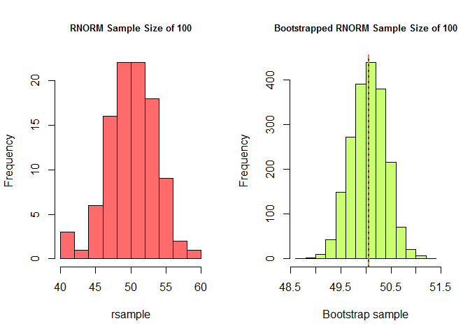
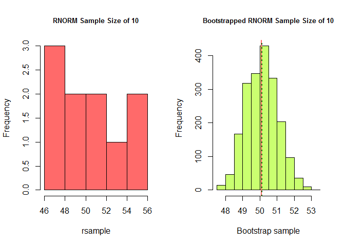
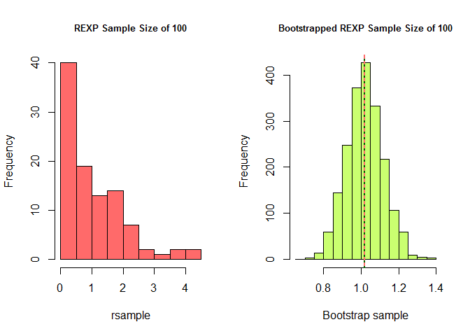
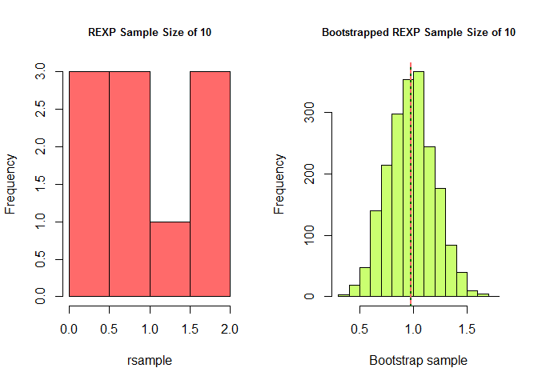

# Cboomhower_BootstrapRAssignment
Chris Boomhower  
June 1, 2016  

### Assignment instructions per 2DS Week 4 Homework:
> Write bootstrap code to illustrate the central limit theorem in R markdown and push the result to GitHub. Use a normal distribution with two different sample sizes and an exponential distribution with two different sample sizes. Correct code alone is insufficient. Please also comment on the code and explain the results. For help, see the lotsa.medians function in unit 2. The deliverable is a link to a GitHub repo containing the code.

<br>

### Function Description:
#### Two different functions were created to generate random normal and exponential data, to visualize said data, to conduct the bootstrap sampling, and to produce bootstrap mean values' summary statistics and histogram data. Detailed descriptions of each function are provided in the code comments below.


```r
##########################################################
## Function: sampFunc()
## Inputs:   n == number of sample data to collect
##           nsim == number of bootstrap sample repeats
##           distType == distribution type specifier
## Outputs:  xbar == norm dist. sample mean
##           sdRSample == norm dist. sample standard deviation
##           bootmean == vector of bootstrap sample means
##           (print) --> random sample summary statistics
##           (plots) --> histogram of sample data
##
## Description: Receives number and type of samples to be 
##              generated and number of bootstrap samples to
##              collect, produces bootstrap samples, and
##              returns the sample mean, sample standard 
##              deviation, and bootstrap sample means.
###########################################################

sampFunc <- function(n, nsim, distType) {
    
    ## Run conditional statement to collect sample based on normal or exponential distribution
    ## and generate histogram of sample data with correct title
    if(distType == "n") {
        rsample <- rnorm(n, 50, 4)
        hist(rsample, main = paste("RNORM Sample Size of", n), col = "indianred1")
    }
    else if(distType == "e") {
        rsample <- rexp(n)
        hist(rsample, main = paste("REXP Sample Size of", n), col = "indianred1")
    }
    
    ## Assign sample standard deviation and mean to variables
    sdRSample <- sd(rsample)
    xbar <- mean(rsample)
    
    ## Print random sample summary results to screen
    cat("Random sample summary statistics:\n")
    print(summary(rsample))
    
    ## Initialize bootmean vector as numeric type of size 'nsim'
    bootmean <- numeric(nsim)
    
    ## Run bootstrap sequence and save bootsample means to bootmean vector
    for (i in 1:nsim){
        bootsample <- sample(rsample, size = length(rsample), replace = TRUE)
        bootmean[i] <- mean(bootsample)
    }
    
    ## Return sample mean, standard deviation, and vector of bootsrap means
    return(c(xbar,sdRSample,bootmean))
}

##########################################################
## Function: analyze()
## Inputs:   N == number of sample data to collect
##           repeats == number of bootstrap sample repeats
##           DistTYPE == distribution type specifier
## Outputs:  (print) --> random sample's summary statistics
##           (print) --> bootstrap sample's summary statistics
##           (print) --> bootstrap sample's standard deviation
##           (print) --> standard error of the sample mean
##           (plots) --> histogram of bootstrap means
##
## Description: Receives number and type of samples to be 
##              generated and number of bootstrap samples to
##              collect, and passes these values to the
##              sampFunc() function. Processes sampFunc()
##              returned values and produces bootstrap mean
##              summary statistics, and standard error of
##              the sample mean. Additionally, bootstrap mean
##              histograms are plotted for comparison to sample
##              histograms and random sample's and bootstrap 
##              sample's standard deviations are displayed.
###########################################################

analyze <- function(N, repeats, DistTYPE) {
    
    ## Obtain sample mean, sample sd, and bootstrap mean from random distribution
    funcReturn <- sampFunc(N, repeats, DistTYPE)
    sampleMean <- funcReturn[1]
    sampleSD <- funcReturn[2]
    BOOTMean <- funcReturn[-1:-2]
    
    ## Print bootstrap mean summary results to screen
    cat("Bootstrap sample's summary statistics:\n")
    print(summary(BOOTMean))
    
    ## Run conditional statement to print correct histogram
    ## title for normal vs. exponential distribution bootstrap mean data
    if(DistTYPE == distNorm) {
        hist(BOOTMean, main = paste("Bootstrapped RNORM Sample Size of", N),
             xlab = "Bootstrap sample", col = "darkolivegreen1")
    }
    else if(DistTYPE == distExp) {
        hist(BOOTMean, main = paste("Bootstrapped REXP Sample Size of", N),
             xlab = "Bootstrap sample", col = "darkolivegreen1")
    }
    ## Add sample mean and bootstrap mean of means lines for comparison in bootstrap histogram
    abline(v = sampleMean, col = "indianred1", lwd = 2)
    abline(v = mean(BOOTMean), col = "darkgreen", lwd = 2, lty = 3)
    
    # Print random sample and bootstrap standard deviations and standard error
    print(paste("Random sample's standard deviation =",round(sampleSD,4)))
    print(paste("Bootstrap means' standard deviation =",round(sd(BOOTMean),4)))
    print(paste("Standard error of the sample mean =",round((sampleSD/sqrt(N)),4)))
}
```

<br>

### Bootstrapping Setup:
#### I chose to collect sample sizes of 10 and 100 for both random normal and random exponential sampling to get a good look at how very different sample sizes perform when bootstrapped. For bootsrap sample collection, I opted to run 2000 bootstrap samples.

```r
## Initialize variables
repeats <- 2000 # Number of bootstrap samples to collect
distNorm <- "n" # Normal distribution selection
distExp <- "e" # Exponential distribution selection
samp1 <- 100
samp2 <- 10
```

<br>

### Normal Distribution Outputs - Sample Size of 100

```r
## Set graphical parameters for histograms
par(mfrow = c(1, 2), cex.main = 0.8)  # 2 rows and 2 columns with title text shrink by 20%

## Normal Distribution 100 Samples - Demonstration of Central Limit Theorem
analyze(samp1, repeats, distNorm)
```

```
## Random sample summary statistics:
##    Min. 1st Qu.  Median    Mean 3rd Qu.    Max. 
##   40.31   47.85   50.41   50.06   52.15   58.20 
## Bootstrap sample's summary statistics:
##    Min. 1st Qu.  Median    Mean 3rd Qu.    Max. 
##   48.79   49.81   50.06   50.05   50.30   51.23
```

<!-- -->

```
## [1] "Random sample's standard deviation = 3.4366"
## [1] "Bootstrap means' standard deviation = 0.3459"
## [1] "Standard error of the sample mean = 0.3437"
```

<br>

### Normal Distribution Outputs - Sample Size of 10

```r
## Set graphical parameters for histograms
par(mfrow = c(1, 2), cex.main = 0.8)  # 2 rows and 2 columns with title text shrink by 20%

## Normal Distribution 10 Samples - Demonstration of Central Limit Theorem
analyze(samp2, repeats, distNorm)
```

```
## Random sample summary statistics:
##    Min. 1st Qu.  Median    Mean 3rd Qu.    Max. 
##   46.05   47.85   49.74   50.10   52.59   54.88 
## Bootstrap sample's summary statistics:
##    Min. 1st Qu.  Median    Mean 3rd Qu.    Max. 
##   47.50   49.44   50.11   50.12   50.76   53.49
```

<!-- -->

```
## [1] "Random sample's standard deviation = 3.169"
## [1] "Bootstrap means' standard deviation = 0.9227"
## [1] "Standard error of the sample mean = 1.0021"
```

<br>

### Exponential Distribution Outputs - Sample Size of 100

```r
## Set graphical parameters for histograms
par(mfrow = c(1, 2), cex.main = 0.8)  # 2 rows and 2 columns with title text shrink by 20%

## Exponential Distribution 100 Samples - Demonstration of Central Limit Theorem
analyze(samp1, repeats, distExp)
```

```
## Random sample summary statistics:
##     Min.  1st Qu.   Median     Mean  3rd Qu.     Max. 
## 0.000031 0.270000 0.736900 1.020000 1.537000 4.421000 
## Bootstrap sample's summary statistics:
##    Min. 1st Qu.  Median    Mean 3rd Qu.    Max. 
##  0.6916  0.9554  1.0170  1.0190  1.0850  1.3530
```

<!-- -->

```
## [1] "Random sample's standard deviation = 0.9934"
## [1] "Bootstrap means' standard deviation = 0.0975"
## [1] "Standard error of the sample mean = 0.0993"
```

<br>

### Exponential Distribution Outputs - Sample Size of 10

```r
## Set graphical parameters for histograms
par(mfrow = c(1, 2), cex.main = 0.8)  # 2 rows and 2 columns with title text shrink by 20%

## Exponential Distribution 10 Samples - Demonstration of Central Limit Theorem
analyze(samp2, repeats, distExp)
```

```
## Random sample summary statistics:
##    Min. 1st Qu.  Median    Mean 3rd Qu.    Max. 
## 0.08366 0.36300 0.93980 0.97740 1.62300 1.93400 
## Bootstrap sample's summary statistics:
##    Min. 1st Qu.  Median    Mean 3rd Qu.    Max. 
##  0.3176  0.8314  0.9826  0.9795  1.1200  1.7420
```

<!-- -->

```
## [1] "Random sample's standard deviation = 0.7004"
## [1] "Bootstrap means' standard deviation = 0.2149"
## [1] "Standard error of the sample mean = 0.2215"
```

<br>

### Results in Review:
#### The Central Limit Theorem is clearly displayed when comparing the effects of bootstrapping on randomized sample sizes of 10 and 100. This applies for both normal and exponentially distributed data. The summary statistics indicate that the original sample data is spread over a larger range than the bootstrapped data and that the original data has a wider IQR as well, suggesting a larger standard deviation. Of additional interest is that the mean of the original random sample data and the mean of the bootstrapped data are practically equal. We can imagine the original data is being treated as though it were the population, so when taking many samples from this population and calculating the mean of the samples, the bootstrap sample mean is expected to be close to the original data.

#### When plotting original data and bootstrapped data in histogram form, it is easier to see that the bootstrapped data is also more normally distributed than the original data. This is most obvious for exponentially distributed samples. It's important to note that sample sizes of 100 seem to distribute more normally and tightly when bootstrapping than the sample size of 10. For example, the bootstrapped data for sample sizes of 10 have ranges that are only a little tighter than the orignal data; the difference in range is greater as the original sample size increases. Also note that the original sample mean is drawn as a red line on the bootstrap histograms and bootstrap mean is drawn in dotted blue to compare the mean values referenced in the summary statistics.

#### Finally, the random sample's and bootstrap sample's standard deviations are calculated to further confirm that standard deviation improves with implementation of the Central Limit Theorem. Standard error of the sample mean is calculated for additional reference.
