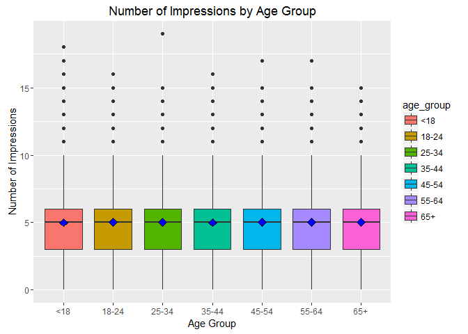
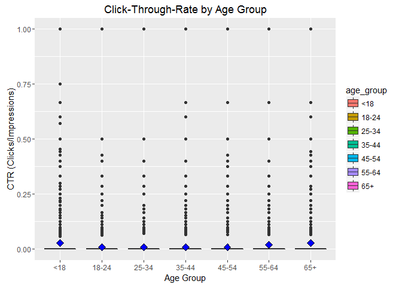
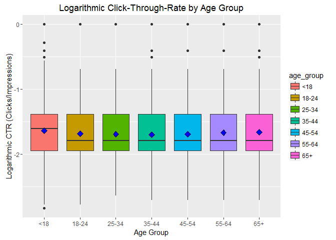
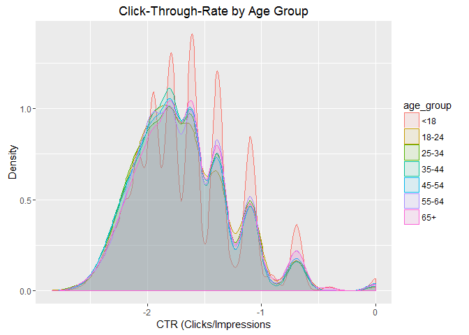
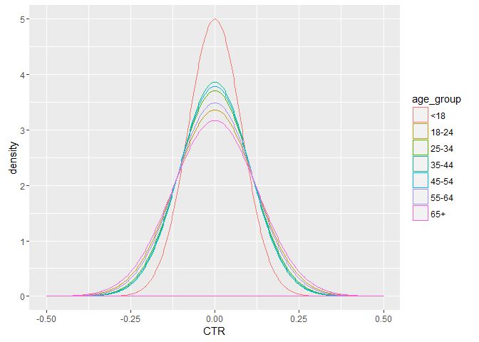
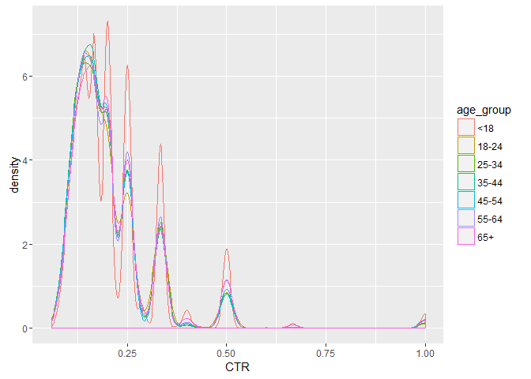
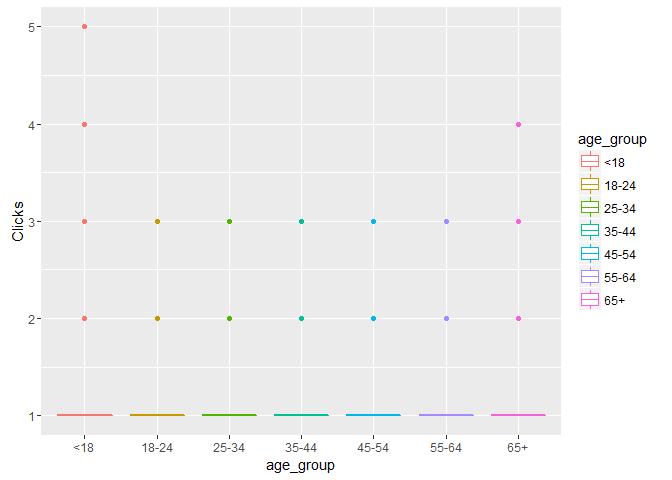
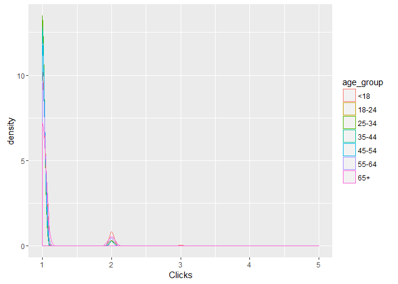

# Cboomhower_HW8_NYT
Chris Boomhower  
June 25, 2016  


##Unit 8 Live Session Prep Instructions:
* #### Download the clickstream data. Data can be downloaded from GitHub at https://github.com/oreillymedia/doing_data_science. Do not use the data link in Rpubs.
* #### Create a new variable ageGroup that categorizes age into following groups: < 18, 18-24, 25-34, 35-44, 45-54, 55-64 and 65+.
* #### For a single day:
    * #### Plot distributions of number impressions and click?through?rate (CTR = click/impression) for the age groups.
    * #### Define new variable to segment users based on click behavior.
    * #### Explore data and make visual comparisons across user segments.
    * #### Create metrics/measurement/statistics that summarize the data.
    
###Load libraries and data

```r
library(ggplot2)
library(doBy)

## Data obtained in zipped form from GitHub at https://github.com/oreillymedia/doing_data_science
ClickDa <- read.csv("nyt15.csv") # Import data
str(ClickDa)
```

```
## 'data.frame':	437567 obs. of  5 variables:
##  $ Age        : int  0 49 0 86 56 57 0 0 0 77 ...
##  $ Gender     : int  0 0 0 0 1 0 0 0 0 0 ...
##  $ Impressions: int  6 3 8 4 1 8 9 7 3 4 ...
##  $ Clicks     : int  0 0 0 0 0 0 1 0 0 0 ...
##  $ Signed_In  : int  0 1 0 1 1 1 0 0 0 1 ...
```

###Create age_group variable to categorize by ages < 18, 18-24, 25-34, 35-44, 45-54, 55-64 and 65+

```r
## Create age_group category
ClickDa$age_group <- cut(ClickDa$Age,c(-Inf,18,24,34,44,54,64,Inf)) # Categorize users by "<18","18-24","25-34","35-44","45-54","55-64", and "65+"
head(ClickDa) # Check to see that age_group categories added
```

```
##   Age Gender Impressions Clicks Signed_In age_group
## 1   0      0           6      0         0 (-Inf,18]
## 2  49      0           3      0         1   (44,54]
## 3   0      0           8      0         0 (-Inf,18]
## 4  86      0           4      0         1 (64, Inf]
## 5  56      1           1      0         1   (54,64]
## 6  57      0           8      0         1   (54,64]
```

```r
levels(ClickDa$age_group) <- c("<18","18-24","25-34","35-44","45-54","55-64","65+") # Update category names (cut() created factor so we need to change the factor levels)
levels(ClickDa$age_group) # Confirm change
```

```
## [1] "<18"   "18-24" "25-34" "35-44" "45-54" "55-64" "65+"
```

```r
head(ClickDa)
```

```
##   Age Gender Impressions Clicks Signed_In age_group
## 1   0      0           6      0         0       <18
## 2  49      0           3      0         1     45-54
## 3   0      0           8      0         0       <18
## 4  86      0           4      0         1       65+
## 5  56      1           1      0         1     55-64
## 6  57      0           8      0         1     55-64
```

###Plot Impressions by age_group for EDA

```r
## Explore Impressions by age_group
ggplot(data = ClickDa, aes(x=age_group, y=Impressions, fill=age_group)) +
    geom_boxplot() + stat_summary(fun.y=mean, geom="point", shape=23, size=3, fill="blue") +     # Add blue mean diamond marker to boxplot
    xlab("Age Group") + ylab("Number of Impressions") + ggtitle("Number of Impressions by Age Group")
```

<!-- -->

###Create click-through-rate variable

```r
## Add CTR column
ClickDb <- ClickDa
ClickDb$CTR <- ifelse(ClickDb$Impressions == 0, NA, ClickDb$Clicks/ClickDb$Impressions) # If Impressions value is 0, mark the CTR value as NA, otherwise calculate CTR
```

###Plot CTR and log of CTR for EDA

```r
## Explore CTR by age_group
ggplot(data = na.omit(ClickDb), aes(x=age_group, y=CTR, fill=age_group)) +
    geom_boxplot() + stat_summary(fun.y=mean, geom="point", shape=23, size=3, fill="blue") +     # Add blue mean diamond marker to boxplot
    xlab("Age Group") + ylab("CTR (Clicks/Impressions)") + ggtitle("Click-Through-Rate by Age Group")
```

<!-- -->

```r
## Explore log of CTR by age_group for better distribution comparison (boxplot)
ggplot(data = na.omit(ClickDb), aes(x=age_group, y=log(CTR), fill=age_group)) +
    geom_boxplot() + stat_summary(fun.y=mean, geom="point", shape=23, size=3, fill="blue") +     # Add blue mean diamond marker to boxplot
    xlab("Age Group") + ylab("Logarithmic CTR (Clicks/Impressions)") + ggtitle("Logarithmic Click-Through-Rate by Age Group") # Provide labels
```

<!-- -->

```r
## Explore log of CTR by age_group for better distribution comparison (density plot)
ggplot(data = na.omit(ClickDb), aes(x=log(CTR), fill=age_group, color=age_group)) +
    geom_density(alpha = 0.1) +
    xlab("CTR (Clicks/Impressions") + ylab("Density") + ggtitle("Click-Through-Rate by Age Group") # Provide labels
```

<!-- -->

###Create new user segmentation variable

```r
## Create User segments based on click behaviour
ClickDc <- ClickDb
ClickDc$User.Seg[ClickDc$Impressions == 0] <- "NoImps"
ClickDc$User.Seg[ClickDc$Impressions > 0] <- "Imps"
ClickDc$User.Seg[ClickDc$Clicks > 0] <- "Clicks"
```

###Plot CTR and clicks by user segmentation for EDA

```r
## Additional exploratory analysis
ggplot( subset( ClickDc, User.Seg == "Imps"), aes( x = CTR, colour = age_group)) + geom_density() # Look at CTR density for users with impressions but no clicks
```

<!-- -->

```r
ggplot( subset( ClickDc, User.Seg == "Clicks"), aes( x = CTR, colour = age_group)) + geom_density() # Look at CTR density for users with clicks
```

<!-- -->

```r
ggplot( subset( ClickDc, User.Seg == "Clicks"), aes( x = age_group, y = Clicks, colour = age_group)) + geom_boxplot() # Look at Clicks by age_group for users with clicks
```

<!-- -->

```r
ggplot( subset( ClickDc, User.Seg == "Clicks"), aes( x = Clicks, colour = age_group)) + geom_density() # Look at Clicks density for users with clicks
```

<!-- -->

###Generate summary statistics to summarize the data

```r
## Convert User.Seg column to factor and compare user click behaviour by demographics
ClickDc$User.Seg <- factor(ClickDc$User.Seg)
summaryBy( Impressions ~ User.Seg + Gender + age_group, data = ClickDc, FUN = c(length,mean,median)) # Provide Impression statistics by demographics (length denotes how many users from each demographic fall in each user segment)
```

```
##    User.Seg Gender age_group Impressions.length Impressions.mean
## 1    Clicks      0       <18              26385         5.925071
## 2    Clicks      0     18-24                616         5.970779
## 3    Clicks      0     25-34               1040         5.945192
## 4    Clicks      0     35-44               1180         5.955085
## 5    Clicks      0     45-54               1121         5.833185
## 6    Clicks      0     55-64               1541         5.909799
## 7    Clicks      0       65+               1882         5.984060
## 8    Clicks      1       <18               1146         5.897033
## 9    Clicks      1     18-24                691         5.958032
## 10   Clicks      1     25-34               1086         5.982505
## 11   Clicks      1     35-44               1313         6.057121
## 12   Clicks      1     45-54               1280         6.064063
## 13   Clicks      1     55-64               1701         5.920047
## 14   Clicks      1       65+               1106         5.976492
## 15     Imps      0       <18             174259         4.892430
## 16     Imps      0     18-24              11863         4.979853
## 17     Imps      0     25-34              19459         4.975898
## 18     Imps      0     35-44              23509         4.994981
## 19     Imps      0     45-54              21467         4.987562
## 20     Imps      0     55-64              14212         4.938432
## 21     Imps      0       65+              11950         4.932720
## 22     Imps      1       <18               7968         4.935241
## 23     Imps      1     18-24              13116         5.013419
## 24     Imps      1     25-34              21522         4.998885
## 25     Imps      1     35-44              26561         4.969692
## 26     Imps      1     45-54              24023         4.987845
## 27     Imps      1     55-64              15985         4.949140
## 28     Imps      1       65+               6735         4.882851
## 29   NoImps      0       <18               1338         0.000000
## 30   NoImps      0     18-24                 85         0.000000
## 31   NoImps      0     25-34                113         0.000000
## 32   NoImps      0     35-44                173         0.000000
## 33   NoImps      0     45-54                145         0.000000
## 34   NoImps      0     55-64                 89         0.000000
## 35   NoImps      0       65+                 96         0.000000
## 36   NoImps      1       <18                 50         0.000000
## 37   NoImps      1     18-24                 93         0.000000
## 38   NoImps      1     25-34                148         0.000000
## 39   NoImps      1     35-44                177         0.000000
## 40   NoImps      1     45-54                169         0.000000
## 41   NoImps      1     55-64                123         0.000000
## 42   NoImps      1       65+                 51         0.000000
##    Impressions.median
## 1                   6
## 2                   6
## 3                   6
## 4                   6
## 5                   6
## 6                   6
## 7                   6
## 8                   6
## 9                   6
## 10                  6
## 11                  6
## 12                  6
## 13                  6
## 14                  6
## 15                  5
## 16                  5
## 17                  5
## 18                  5
## 19                  5
## 20                  5
## 21                  5
## 22                  5
## 23                  5
## 24                  5
## 25                  5
## 26                  5
## 27                  5
## 28                  5
## 29                  0
## 30                  0
## 31                  0
## 32                  0
## 33                  0
## 34                  0
## 35                  0
## 36                  0
## 37                  0
## 38                  0
## 39                  0
## 40                  0
## 41                  0
## 42                  0
```

```r
## Additional summary statistics of interest
tapply(ClickDc$Impressions, ClickDc$age_group, summary) # Overall Impressions summary stats by age_group
```

```
## $`<18`
##    Min. 1st Qu.  Median    Mean 3rd Qu.    Max. 
##   0.000   3.000   5.000   4.996   6.000  18.000 
## 
## $`18-24`
##    Min. 1st Qu.  Median    Mean 3rd Qu.    Max. 
##   0.000   3.000   5.000   5.012   6.000  16.000 
## 
## $`25-34`
##    Min. 1st Qu.  Median    Mean 3rd Qu.    Max. 
##   0.000   3.000   5.000   5.006   6.000  19.000 
## 
## $`35-44`
##    Min. 1st Qu.  Median    Mean 3rd Qu.    Max. 
##   0.000   3.000   5.000   4.997   6.000  16.000 
## 
## $`45-54`
##    Min. 1st Qu.  Median    Mean 3rd Qu.    Max. 
##   0.000   3.000   5.000   5.003   6.000  17.000 
## 
## $`55-64`
##    Min. 1st Qu.  Median    Mean 3rd Qu.    Max. 
##   0.000   3.000   5.000   5.007   6.000  17.000 
## 
## $`65+`
##    Min. 1st Qu.  Median    Mean 3rd Qu.    Max. 
##   0.000   3.000   5.000   5.028   6.000  15.000
```

```r
tapply(ClickDc$Clicks, ClickDc$age_group, summary) # Overall Clicks summary stats by age_group
```

```
## $`<18`
##    Min. 1st Qu.  Median    Mean 3rd Qu.    Max. 
##  0.0000  0.0000  0.0000  0.1417  0.0000  5.0000 
## 
## $`18-24`
##    Min. 1st Qu.  Median    Mean 3rd Qu.    Max. 
## 0.00000 0.00000 0.00000 0.05109 0.00000 3.00000 
## 
## $`25-34`
##    Min. 1st Qu.  Median    Mean 3rd Qu.    Max. 
## 0.00000 0.00000 0.00000 0.05008 0.00000 3.00000 
## 
## $`35-44`
##    Min. 1st Qu.  Median    Mean 3rd Qu.    Max. 
## 0.00000 0.00000 0.00000 0.04825 0.00000 3.00000 
## 
## $`45-54`
##    Min. 1st Qu.  Median    Mean 3rd Qu.    Max. 
## 0.00000 0.00000 0.00000 0.05114 0.00000 3.00000 
## 
## $`55-64`
##    Min. 1st Qu.  Median    Mean 3rd Qu.    Max. 
##  0.0000  0.0000  0.0000  0.1009  0.0000  3.0000 
## 
## $`65+`
##    Min. 1st Qu.  Median    Mean 3rd Qu.    Max. 
##  0.0000  0.0000  0.0000  0.1474  0.0000  4.0000
```

```r
tapply(ClickDc$CTR, ClickDc$age_group, summary) # Overal CTR summary stats by age_group
```

```
## $`<18`
##    Min. 1st Qu.  Median    Mean 3rd Qu.    Max.    NA's 
##  0.0000  0.0000  0.0000  0.0284  0.0000  1.0000    1388 
## 
## $`18-24`
##    Min. 1st Qu.  Median    Mean 3rd Qu.    Max.    NA's 
## 0.00000 0.00000 0.00000 0.01012 0.00000 1.00000     178 
## 
## $`25-34`
##    Min. 1st Qu.  Median    Mean 3rd Qu.    Max.    NA's 
## 0.00000 0.00000 0.00000 0.00997 0.00000 1.00000     261 
## 
## $`35-44`
##    Min. 1st Qu.  Median    Mean 3rd Qu.    Max.    NA's 
##  0.0000  0.0000  0.0000  0.0095  0.0000  1.0000     350 
## 
## $`45-54`
##    Min. 1st Qu.  Median    Mean 3rd Qu.    Max.    NA's 
## 0.00000 0.00000 0.00000 0.01025 0.00000 1.00000     314 
## 
## $`55-64`
##    Min. 1st Qu.  Median    Mean 3rd Qu.    Max.    NA's 
## 0.00000 0.00000 0.00000 0.02021 0.00000 1.00000     212 
## 
## $`65+`
##    Min. 1st Qu.  Median    Mean 3rd Qu.    Max.    NA's 
## 0.00000 0.00000 0.00000 0.02908 0.00000 1.00000     147
```
