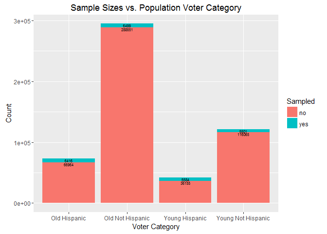
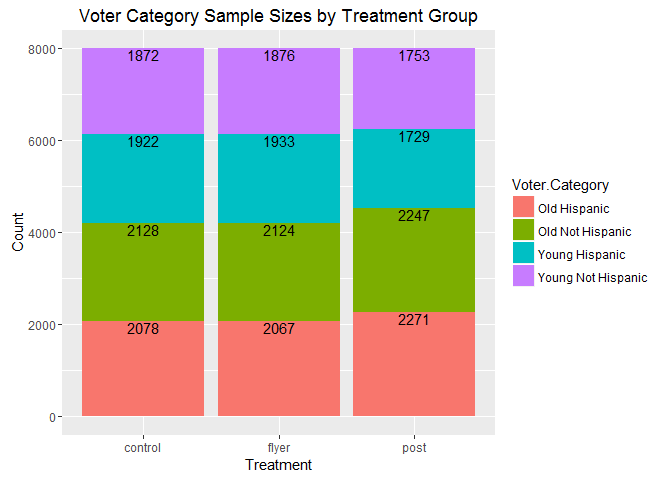
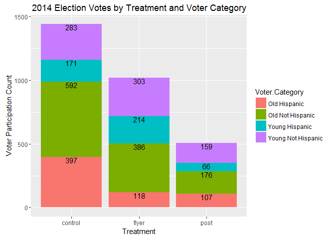
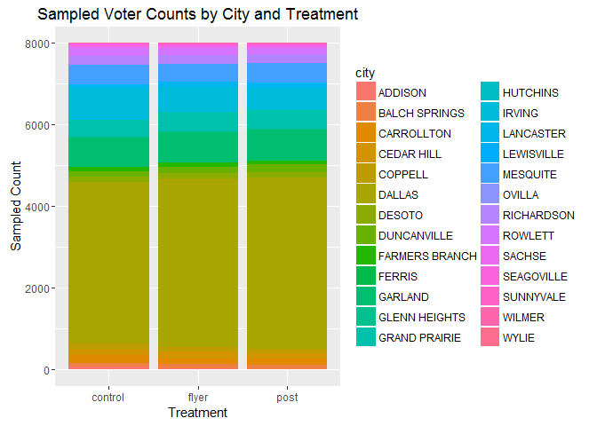
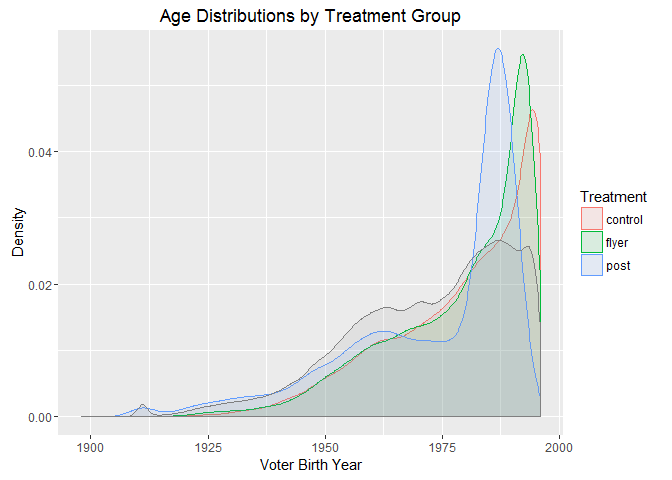

# League of Women Voters: 2014 Election Voter Participation Study Debug
Chris Boomhower  
July 12, 2016  


##Introduction
####The League of Women Voters (LWV) enlisted SMU students to conduct a study of the effects of sending low-perpensity voters postcards and flyers, reminding them to vote, on voter participation. Surprisingly, there was higher voter participation among control group members who did not receive any LWV reminders in the mail than those who did.

####The purpose of this analysis, or case study debug, is to uncover why expectations were not met. As the outcome was so very different from what was expected, there may very well be a problem with how the study was performed. This analysis will focus most greatly on sample origin and population representation to uncover the reason for this unexpected outcome.


##Data Analysis

###Data Import
####The data were first downloaded from https://s3-us-west-2.amazonaws.com/smu-mds/prod/MSDS+6306+Doing+Data+Science/Week+8/homework/LWV_Data.csv and saved locally. The CSV file was then imported into R as below.


```r
library(ggplot2)
library(scales)

LWV <- read.csv("C:\\Users\\Owner\\Documents\\GitHub\\MSDS_6306\\MSDS6306_HwUploads\\HW8_LWV\\LWV_Data.csv", header = TRUE, stringsAsFactors = FALSE)
str(LWV)
```

```
## 'data.frame':	531735 obs. of  27 variables:
##  $ VOTED2014               : int  0 0 0 0 0 0 0 0 0 1 ...
##  $ Young.Hispanic.Status   : chr  "non_y_non_h" "non_y_non_h" "non_y_non_h" "non_y_non_h" ...
##  $ ID.Number               : int  186 669 1483 1527 1643 1882 2164 2499 2880 3020 ...
##  $ Voter.Status            : chr  "A" "A" "A" "A" ...
##  $ Voted.11.2012           : int  0 0 0 0 0 0 0 0 0 1 ...
##  $ Voted.Gen..Elec..09.2010: int  0 0 0 0 0 0 0 0 0 0 ...
##  $ Voted.Gen..Elec..07.2008: int  0 0 1 1 0 0 1 1 1 0 ...
##  $ Number.General.Elections: int  0 0 1 1 0 0 1 1 1 1 ...
##  $ Hispanic.Surname        : int  0 0 0 0 0 0 0 0 0 0 ...
##  $ Young.Voter             : int  0 0 0 0 0 0 0 0 0 0 ...
##  $ Eligible.2012           : int  1 1 1 1 1 1 1 1 1 1 ...
##  $ Eligible.2010           : int  1 1 1 1 1 1 1 1 1 1 ...
##  $ Eligible.2008           : int  1 1 1 1 1 1 1 1 1 1 ...
##  $ Young.in.2012           : int  0 0 0 0 0 0 0 0 0 0 ...
##  $ Young.in.2010           : int  0 0 0 0 0 0 0 0 0 0 ...
##  $ Young.in.2008           : int  0 0 0 0 0 0 0 0 0 0 ...
##  $ Voter.Category          : chr  "Old Not Hispanic" "Old Not Hispanic" "Old Not Hispanic" "Old Not Hispanic" ...
##  $ type                    : chr  "" "" "" "" ...
##  $ ID                      : int  186 669 1483 1527 1643 1882 2164 2499 2880 3020 ...
##  $ control                 : int  NA NA NA NA NA NA NA NA NA NA ...
##  $ post                    : int  NA NA NA NA NA NA NA NA NA NA ...
##  $ flyer                   : int  NA NA NA NA NA NA NA NA NA NA ...
##  $ LOWPROP                 : int  1 1 1 1 1 1 1 1 1 1 ...
##  $ city                    : chr  "DALLAS" "DALLAS" "CARROLLTON" "CARROLLTON" ...
##  $ zip                     : int  75230 75229 75006 75006 75019 75006 75251 75006 75006 75234 ...
##  $ U_S__CONGRESS           : int  24 32 24 24 24 24 32 24 24 24 ...
##  $ byear                   : int  1938 1953 1911 1931 1948 1928 1926 1919 1924 1944 ...
```

###Variables Added
####Before anything else, the treatment group sizes are first confirmed since the expectation is that 24,000 voters were randomly selected from the population and that samples were then randomly assigned to one of three groups with 8000 in each.

```r
## Confirm number of observations for each group
nrow(subset(LWV,LWV$control == 1))
```

```
## [1] 8000
```

```r
nrow(subset(LWV,LWV$post == 1))
```

```
## [1] 8000
```

```r
nrow(subset(LWV,LWV$flyer == 1))
```

```
## [1] 8000
```

####Because the treatment groups are divided among three separate variables in the data set, they are next combined into a single "Treatment" column for easier manipulation while generating plots. In addition, a "Sampled" column is generated, providing a simple binary result of either "yes" or "no" for each each voter in the population. This, too, will prove useful when visualizing the data later in this debug analysis.

```r
LWV.calc <- LWV

## Create treatment column for easier plotting
LWV.calc$Treatment <- ifelse(LWV$control == 1, c("control"),
                        ifelse(LWV$flyer == 1, c("flyer"),
                               ifelse(LWV$post == 1, c("post"), c("Not Sampled"))))

## Create sample flag column for easier plotting
LWV.calc$Sampled <- ifelse(!is.na(LWV$control), c("yes"), c("no"))
```

###Population and Sample Demographics
####To better understand how the 8000 sampled voters can be divided demographically, the voter categories are reviewed. It is determined the voter population is divided into 4 voter categories: young Hispanics, young non-Hispanics, old Hispanics, and old non-Hispanics. The size of each voter category across the entire population is then displayed. The output results show that there are far more old non-Hispanic voters than any other category and that the number of voters from each category differs rather significantly from one category to another.

```r
## Look at voter category options and extract groups for further analysis
unique(LWV.calc$Voter.Category)
```

```
## [1] "Old Not Hispanic"   "Old Hispanic"       "Young Not Hispanic"
## [4] "Young Hispanic"
```

```r
yhVoters <- LWV.calc[grep("Young Hispanic", LWV.calc$Voter.Category),]    #Extract young hispanic
ynhVoters <- LWV.calc[grep("Young Not", LWV.calc$Voter.Category),]        #Extract young non-hispanic
onhVoters <- LWV.calc[grep("Old Not", LWV.calc$Voter.Category),]          #Extract old non-hispanic
ohVoters <- LWV.calc[grep("Old Hispanic", LWV.calc$Voter.Category),]      #Extract old hispanic

nrow(yhVoters)     #Sum number of young Hispanics in population
```

```
## [1] 41739
```

```r
nrow(ynhVoters)    #Sum number of young non-Hispanics in population
```

```
## [1] 121566
```

```r
nrow(onhVoters)    #Sum number of old non-Hispanics in population
```

```
## [1] 295050
```

```r
nrow(ohVoters)     #Sum number of old Hispanics in population
```

```
## [1] 73380
```

####Since a random sample should have been performed to assign treatment group voters, it is likely that most of the voters sampled were from the old non-Hispanic category and that the least came from the young Hispanic category. The percentage of voters sampled and a plot indicating the sampled count from each population voter category are reviewed next.

```r
## Calculate percentages of population sampled
ohVoters.Percent <- percent(nrow(subset(LWV.calc, Sampled == "yes" & Voter.Category == "Old Hispanic"))/nrow(LWV.calc[LWV.calc$Voter.Category == "Old Hispanic",]))
onhVoters.Percent <- percent(nrow(subset(LWV.calc, Sampled == "yes" & Voter.Category == "Old Not Hispanic"))/nrow(LWV.calc[LWV.calc$Voter.Category == "Old Not Hispanic",]))
yhVoters.Percent <- percent(nrow(subset(LWV.calc, Sampled == "yes" & Voter.Category == "Young Hispanic"))/nrow(LWV.calc[LWV.calc$Voter.Category == "Young Hispanic",]))
ynhVoters.Percent <- percent(nrow(subset(LWV.calc, Sampled == "yes" & Voter.Category == "Young Not Hispanic"))/nrow(LWV.calc[LWV.calc$Voter.Category == "Young Not Hispanic",]))

ohVoters.Percent    #Percentage of Old Hispanic voter population sampled
```

```
## [1] "8.74%"
```

```r
onhVoters.Percent   #Percentage of Old Not Hispanic voter population sampled
```

```
## [1] "2.2%"
```

```r
yhVoters.Percent    #Percentage of Young Hispanic voter population sampled
```

```
## [1] "13.4%"
```

```r
ynhVoters.Percent   #Percentage of Young Not Hispanic voter population sampled
```

```
## [1] "4.53%"
```

```r
## Plot count comparison of sampled vs. non sampled data by voter category and compare sampled percentages
ggplot(LWV.calc, aes(Voter.Category, fill = Sampled)) + geom_bar() +
    geom_text(stat = 'count', aes(label = ..count..), vjust = 1, size = 2, position = "stack") +
    ggtitle("Sample Sizes vs. Population Voter Category") + xlab("Voter Category") + ylab("Count")
```

<!-- -->

####Though the above percentage values are not enitirely informative, the plot of sample sizes vs. population voter categories is. It is odd that roughly the same number of samples were collected from each voter category. Delving into this matter further, a comparison of treatment group demographics is made next.

```r
## Plot count comparison of voter category by treatment among sampled observations
ggplot(LWV.calc[LWV.calc$Sampled == "yes",], aes(Treatment, fill = Voter.Category)) + geom_bar() +
    geom_text(stat = 'count', aes(label = ..count..), vjust = 1, position = "stack") +
    ggtitle("Voter Category Sample Sizes by Treatment Group") + xlab("Treatment") + ylab("Count")
```

<!-- -->

####The roughly equal number of voters from each voter category in each treatment group is alarming. Based on the differing voter category counts across the population, it is expected these sampled voter category counts would be more representative of the population and not so similar in numbers. The chance of having such an even split across each treatment group is extremely small when random sampling. This suggests random sampling was not performed correctly. The number of voters from each category who actually voted in 2014 can be plotted by treatment for a closer look at how poor sampling affected the participation results. Percentage of votes from each treatment is also output.

```r
## Plot Voter Category 2014 voter count comparison by Treatment
ggplot(LWV.calc[LWV.calc$Sampled == "yes" & LWV.calc$VOTED2014 == 1,], aes(Treatment, fill = Voter.Category)) + geom_bar() +
    geom_text(stat = 'count', aes(label = ..count..), vjust = 1, position = "stack") +
    ggtitle("2014 Election Votes by Treatment and Voter Category") + xlab("Treatment") + ylab("Voter Participation Count")
```

<!-- -->

```r
## Provide percentages voted from each Treatment group
percent(nrow(LWV.calc[LWV.calc$Sampled == "yes" & LWV.calc$VOTED2014 == 1 & LWV.calc$Treatment == "control",]) / 8000)
```

```
## [1] "18%"
```

```r
percent(nrow(LWV.calc[LWV.calc$Sampled == "yes" & LWV.calc$VOTED2014 == 1 & LWV.calc$Treatment == "flyer",]) / 8000)
```

```
## [1] "12.8%"
```

```r
percent(nrow(LWV.calc[LWV.calc$Sampled == "yes" & LWV.calc$VOTED2014 == 1 & LWV.calc$Treatment == "post",]) / 8000)
```

```
## [1] "6.35%"
```

(It is worth mentioning that the percentages for voter participation in this analysis do not match the percentages provided in the case study problem statement. This cannot be explained because the percentages calculated here are correct reflections of each sample treatment group...)

###Random Sampling Example
####To further illustrate the presumed absence of true random sampling, a test case is illustrated in which a true random sample is performed to sample 8000 observations from the same voter population. In so doing this, it is clear that random sampling will most often result in the most samples coming from the old non-Hispanic voter category and the least samples coming from the young Hispanic voter category. This further confirms random sampling was likely not performed correctly during this study.

```r
## Provide example of true random sampling from the voter population
test <- LWV.calc[sample(nrow(LWV.calc), 8000),]

ggplot(test, aes(LOWPROP, fill = Voter.Category)) + geom_bar() +
    geom_text(stat = 'count', aes(label = ..count..), vjust = 1, position = "stack") +
    theme(axis.ticks = element_blank(), axis.text.x = element_blank()) +
    ggtitle("Example of Truly Randomized Sampling") + xlab("Example Sample") + ylab("Count")
```

<!-- -->

###Further Exploration
####Curious whether any other issues may be present with how the data were sampled, the cities of residence for the population and city for each sampled voter are reviewed as well. Below is a pie chart describing the general distribution of cities among members of the population. Dallas clearly contains the highest number of eligble voters. Following the pie chart, the sample distribution by city is reviewed for each treatment category. These results indicate random sampling was likely performed correctly in regards to city since the samples are representitive of the population distribution. City distribution is not a problem.

```r
## Plot overall voter population city count comparison
ggplot(LWV.calc, aes(x = factor(1), fill = city)) +
    geom_bar(width = 1) +
    coord_polar(theta = "y") +
    ggtitle("Overall Voter Population City Comparison") +
    theme(axis.title.x = element_blank(), axis.title.y = element_blank())
```

<!-- -->

```r
## Prepare treatment subsets for plotting
controlSubset <- subset(LWV.calc, Treatment == "control")
postSubset <- subset(LWV.calc, Treatment == "post")
flyerSubset <- subset(LWV.calc, Treatment == "flyer")

ggplot(LWV.calc[LWV.calc$Sampled == "yes",], aes(Treatment, fill = city)) + geom_bar() +
    ggtitle("Sampled Voter Counts by City and Treatment") + xlab("Treatment") + ylab("Sampled Count")
```

<!-- -->

####Finally, because old and young voters are separated into two groups, young voters being anyone born in 1985 or later (see summary output below), it might be worthwhile to review the age distributions in each treatment by year. Below are the Min, IQR, and Max values for birth year in this study (1 NA is otherwise designated as a young voter). Following the summary, a density plot indicates how young and how old treatment voters are.

```r
yVoters <- LWV.calc[grep("Young", LWV.calc$Voter.Category),]    #Extract young voters
summary(yVoters$byear, na.omit())     #Display birth year summary data
```

```
##    Min. 1st Qu.  Median    Mean 3rd Qu.    Max.    NA's 
##    1985    1987    1990    1990    1993    1996       1
```

```r
## Plot treatment group age comparison
ggplot(LWV.calc, aes(byear, color = Treatment, fill = Treatment)) +
    geom_density(alpha = 0.1) +
    ggtitle("Age Distributions by Treatment Group") + xlab("Voter Birth Year") + ylab("Density")
```

```
## Warning: Removed 1 rows containing non-finite values (stat_density).
```

<!-- -->

####The voter ages in each treatment seem to follow the remaining voters' birth year density curve rather well and there does not appear to be a significantly high concentration of any particular old age in any treatment. As such, birth years do appear to be representitive of the population throughout the treatment group samples. Age distribution is not a problem.

##Conclusion
####In planning this study, the LWV expected to see greater voter turnout among voters who received postcards and flyers encouraging them to vote. However, the opposite outcome occurred. With further investigation, it is apparent the data were likely not sampled correctly from the population.

####While other variables are also reviewed in this analysis, the fairly even number of voters from each voter category comprising each treatment group raises alarm. The uniform distributions almost appear intentional in nature. Whether intentional or not, the samples by voter category are clearly not representative of the population. Had random sampling been performed correctly, the study outcome may very well have been different and more in line with LWV expectations.
