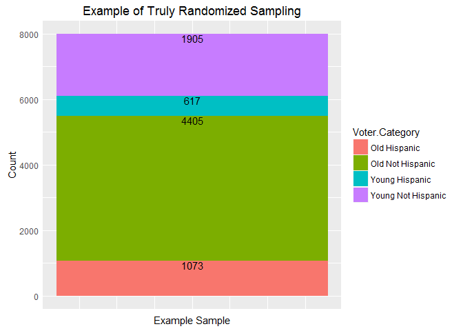

# League of Women Voters: 2014 Election Voter Participation Study Debug
Chris Boomhower  
July 12, 2016  


```r
library(ggplot2)
library(tidyr)
library(scales)
library(gridExtra)

LWV <- read.csv("C:\\Users\\Owner\\Documents\\GitHub\\MSDS_6306\\MSDS6306_HwUploads\\HW8_LWV\\LWV_Data.csv", header = TRUE, stringsAsFactors = FALSE)
str(LWV)
```

```
## 'data.frame':	531735 obs. of  27 variables:
##  $ VOTED2014               : int  0 0 0 0 0 0 0 0 0 1 ...
##  $ Young.Hispanic.Status   : chr  "non_y_non_h" "non_y_non_h" "non_y_non_h" "non_y_non_h" ...
##  $ ID.Number               : int  186 669 1483 1527 1643 1882 2164 2499 2880 3020 ...
##  $ Voter.Status            : chr  "A" "A" "A" "A" ...
##  $ Voted.11.2012           : int  0 0 0 0 0 0 0 0 0 1 ...
##  $ Voted.Gen..Elec..09.2010: int  0 0 0 0 0 0 0 0 0 0 ...
##  $ Voted.Gen..Elec..07.2008: int  0 0 1 1 0 0 1 1 1 0 ...
##  $ Number.General.Elections: int  0 0 1 1 0 0 1 1 1 1 ...
##  $ Hispanic.Surname        : int  0 0 0 0 0 0 0 0 0 0 ...
##  $ Young.Voter             : int  0 0 0 0 0 0 0 0 0 0 ...
##  $ Eligible.2012           : int  1 1 1 1 1 1 1 1 1 1 ...
##  $ Eligible.2010           : int  1 1 1 1 1 1 1 1 1 1 ...
##  $ Eligible.2008           : int  1 1 1 1 1 1 1 1 1 1 ...
##  $ Young.in.2012           : int  0 0 0 0 0 0 0 0 0 0 ...
##  $ Young.in.2010           : int  0 0 0 0 0 0 0 0 0 0 ...
##  $ Young.in.2008           : int  0 0 0 0 0 0 0 0 0 0 ...
##  $ Voter.Category          : chr  "Old Not Hispanic" "Old Not Hispanic" "Old Not Hispanic" "Old Not Hispanic" ...
##  $ type                    : chr  "" "" "" "" ...
##  $ ID                      : int  186 669 1483 1527 1643 1882 2164 2499 2880 3020 ...
##  $ control                 : int  NA NA NA NA NA NA NA NA NA NA ...
##  $ post                    : int  NA NA NA NA NA NA NA NA NA NA ...
##  $ flyer                   : int  NA NA NA NA NA NA NA NA NA NA ...
##  $ LOWPROP                 : int  1 1 1 1 1 1 1 1 1 1 ...
##  $ city                    : chr  "DALLAS" "DALLAS" "CARROLLTON" "CARROLLTON" ...
##  $ zip                     : int  75230 75229 75006 75006 75019 75006 75251 75006 75006 75234 ...
##  $ U_S__CONGRESS           : int  24 32 24 24 24 24 32 24 24 24 ...
##  $ byear                   : int  1938 1953 1911 1931 1948 1928 1926 1919 1924 1944 ...
```

```r
## Confirm number of observations for each group
nrow(subset(LWV,LWV$control == 1))
```

```
## [1] 8000
```

```r
nrow(subset(LWV,LWV$post == 1))
```

```
## [1] 8000
```

```r
nrow(subset(LWV,LWV$flyer == 1))
```

```
## [1] 8000
```

```r
LWV.calc <- LWV

## Create treatment column for easier plotting
LWV.calc$Treatment <- ifelse(LWV$control == 1, c("control"),
                        ifelse(LWV$flyer == 1, c("flyer"),
                               ifelse(LWV$post == 1, c("post"), c("Not Sampled"))))

## Create sample flag column for easier plotting
LWV.calc$Sampled <- ifelse(!is.na(LWV$control), c("yes"), c("no"))

## Look at voter category options and extract groups for further analysis
unique(LWV.calc$Voter.Category)
```

```
## [1] "Old Not Hispanic"   "Old Hispanic"       "Young Not Hispanic"
## [4] "Young Hispanic"
```

```r
yVoters <- LWV.calc[grep("Young", LWV.calc$Voter.Category),]              #Extract young voters
oVoters <- LWV.calc[grep("Old", LWV.calc$Voter.Category),]                #Extract old voters

yhVoters <- LWV.calc[grep("Young Hispanic", LWV.calc$Voter.Category),]    #Extract young hispanic
ynhVoters <- LWV.calc[grep("Young Not", LWV.calc$Voter.Category),]        #Extract young non-hispanic
onhVoters <- LWV.calc[grep("Old Not", LWV.calc$Voter.Category),]          #Extract old non-hispanic
ohVoters <- LWV.calc[grep("Old Hispanic", LWV.calc$Voter.Category),]      #Extract old hispanic

## Look at population demographic counts
nrow(yVoters)
```

```
## [1] 163305
```

```r
nrow(oVoters)
```

```
## [1] 368430
```

```r
## Calculate percentages of population sampled
ohVoters.Percent <- percent(nrow(subset(LWV.calc, Sampled == "yes" & Voter.Category == "Old Hispanic"))/nrow(LWV.calc[LWV.calc$Voter.Category == "Old Hispanic",]))
onhVoters.Percent <- percent(nrow(subset(LWV.calc, Sampled == "yes" & Voter.Category == "Old Not Hispanic"))/nrow(LWV.calc[LWV.calc$Voter.Category == "Old Not Hispanic",]))
yhVoters.Percent <- percent(nrow(subset(LWV.calc, Sampled == "yes" & Voter.Category == "Young Hispanic"))/nrow(LWV.calc[LWV.calc$Voter.Category == "Young Hispanic",]))
ynhVoters.Percent <- percent(nrow(subset(LWV.calc, Sampled == "yes" & Voter.Category == "Young Not Hispanic"))/nrow(LWV.calc[LWV.calc$Voter.Category == "Young Not Hispanic",]))


# LWV.calc$Pop.Percent <- ifelse(LWV.calc$Voter.Category == "Old Hispanic" & LWV.calc$Sampled == "yes", nrow(subset(LWV.calc, Sampled == "yes" & Voter.Category == "Old Hispanic"))/nrow(LWV.calc[LWV.calc$Voter.Category == "Old Hispanic",]),
#                                ifelse(LWV.calc$Sampled == "no", 100 - (100 * nrow(LWV.calc[LWV.calc$Sampled == "yes",])/nrow(LWV.calc)),
#                                       NA))

#LWV.calc <- ddply(LWV.calc, .(Voter.Category), transform, percent = nrow(LWV.calc[LWV.calc$Sampled == "yes",])/())

#ggplot(LWV.calc) + geom_bar(aes(y = Pop.Percent, x = Voter.Category, fill = Sampled), stat = "identity")

## Plot count comparison of sampled vs. non sampled data by voter category and compare sampled percentages
ggplot(LWV.calc, aes(Voter.Category, fill = Sampled)) + geom_bar() +
    geom_text(stat = 'count', aes(label = ..count..), vjust = 1, size = 2, position = "stack") +
    ggtitle("Sample Sizes vs. Voter Category Populations") + xlab("Voter Category") + ylab("Count")
```

<!-- -->

```r
ohVoters.Percent    #Percentage of Old Hispanic voter population sampled
```

```
## [1] "8.74%"
```

```r
onhVoters.Percent   #Percentage of Old Not Hispanic voter population sampled
```

```
## [1] "2.2%"
```

```r
yhVoters.Percent    #Percentage of Young Hispanic voter population sampled
```

```
## [1] "13.4%"
```

```r
ynhVoters.Percent   #Percentage of Young Not Hispanic voter population sampled
```

```
## [1] "4.53%"
```

```r
# ggplot(LWV.calc, aes(x = Voter.Category, fill = Sampled)) +
#     geom_bar(stat = "identity", aes(y = Pop.Percent, ymax = 100), position = "dodge") +
#     geom_text(aes(x = Voter.Category, y = Pop.Percent, ymax = 100, label = Pop.Percent, hjust = 1), position = position_dodge(width = 1)) +
#     scale_y_continuous(labels = comma_format())

## Plot count comparison of voter category by treatment among sampled observations
ggplot(LWV.calc[LWV.calc$Sampled == "yes",], aes(Treatment, fill = Voter.Category)) + geom_bar() +
    geom_text(stat = 'count', aes(label = ..count..), vjust = 1, position = "stack") +
    ggtitle("Voter Category Sample Sizes by Treatment Group") + xlab("Treatment") + ylab("Count")
```

<!-- -->

```r
## Plot Voter Category 2014 voter count comparison by Treatment
ggplot(LWV.calc[LWV.calc$Sampled == "yes" & LWV.calc$VOTED2014 == 1,], aes(Treatment, fill = Voter.Category)) + geom_bar() +
    geom_text(stat = 'count', aes(label = ..count..), vjust = 1, position = "stack") +
    ggtitle("2014 Election Votes by Treatment and Voter Category") + xlab("Treatment") + ylab("Count")
```

<!-- -->

```r
## Provide percentages voted from each Treatment group
percent(nrow(LWV.calc[LWV.calc$Sampled == "yes" & LWV.calc$VOTED2014 == 1 & LWV.calc$Treatment == "control",]) / 8000)
```

```
## [1] "18%"
```

```r
percent(nrow(LWV.calc[LWV.calc$Sampled == "yes" & LWV.calc$VOTED2014 == 1 & LWV.calc$Treatment == "flyer",]) / 8000)
```

```
## [1] "12.8%"
```

```r
percent(nrow(LWV.calc[LWV.calc$Sampled == "yes" & LWV.calc$VOTED2014 == 1 & LWV.calc$Treatment == "post",]) / 8000)
```

```
## [1] "6.35%"
```

```r
## Provide example of true random sampling from the voter population
test <- LWV.calc[sample(nrow(LWV.calc), 8000),]

ggplot(test, aes(LOWPROP, fill = Voter.Category)) + geom_bar() +
    geom_text(stat = 'count', aes(label = ..count..), vjust = 1, position = "stack") +
    theme(axis.ticks = element_blank(), axis.text.x = element_blank()) +
    ggtitle("Example of Truly Randomized Sampling") + xlab("Example Sample") + ylab("Count")
```

<!-- -->

```r
# ## Look at number of control voters in old and young categories and in 4 treatment groups
# nrow(subset(oVoters, oVoters$control == 1))
# nrow(subset(yVoters, yVoters$control == 1))
# 
# nrow(subset(onhVoters, onhVoters$control == 1))
# nrow(subset(ohVoters, ohVoters$control == 1))
# nrow(subset(ynhVoters, ynhVoters$control == 1))
# nrow(subset(yhVoters, yhVoters$control == 1))
# 
# ## Look at number of post voters in old and young categories and in 4 treatment groups
# nrow(subset(oVoters, oVoters$post == 1))
# nrow(subset(yVoters, yVoters$post == 1))
# 
# nrow(subset(onhVoters, onhVoters$post == 1))
# nrow(subset(ohVoters, ohVoters$post == 1))
# nrow(subset(ynhVoters, ynhVoters$post == 1))
# nrow(subset(yhVoters, yhVoters$post == 1))
# 
# ## Look at number of flyer voters in old and young categories and in 4 treatment groups
# nrow(subset(oVoters, oVoters$flyer == 1))
# nrow(subset(yVoters, yVoters$flyer == 1))
# 
# nrow(subset(onhVoters, onhVoters$flyer == 1))
# nrow(subset(ohVoters, ohVoters$flyer == 1))
# nrow(subset(ynhVoters, ynhVoters$flyer == 1))
# nrow(subset(yhVoters, yhVoters$flyer == 1))

## Plot overall voter population city count comparison
ggplot(LWV.calc, aes(x = factor(1), fill = city)) +
    geom_bar(width = 1) +
    coord_polar(theta = "y") +
    ggtitle("Overall Voter Population City Comparison") +
    theme(axis.title.x = element_blank(), axis.title.y = element_blank())
```

<!-- -->

```r
## Prepare treatment subsets for plotting
controlSubset <- subset(LWV.calc, Treatment == "control")
# control.yhVoters <- subset(yhVoters, Treatment == "control")
# control.ynhVoters <- subset(ynhVoters, Treatment == "control")
# control.onhVoters <- subset(onhVoters, Treatment == "control")
# control.ohVoters <- subset(ohVoters, Treatment == "control")

postSubset <- subset(LWV.calc, Treatment == "post")
flyerSubset <- subset(LWV.calc, Treatment == "flyer")

# ## Plot control treatment city count comparison
# pie <- ggplot(controlSubset, aes(x = factor(1), fill = city)) +
#     geom_bar(width = 1)
# pie + coord_polar(theta = "y")
# 
# ## Plot post treatment city count comparison
# pie <- ggplot(postSubset, aes(x = factor(1), fill = city)) +
#     geom_bar(width = 1)
# pie + coord_polar(theta = "y")
# 
# ## Plot flyer treatment city count comparison
# pie <- ggplot(flyerSubset, aes(x = factor(1), fill = city)) +
#     geom_bar(width = 1)
# pie + coord_polar(theta = "y")
# 
# # ggplot(LWV.calc, aes(x = city, fill = city)) +
# #     geom_bar(width = 1)
# 
# ## Plot control treatment Young Hispanic city count comparison
# pie <- ggplot(control.yhVoters, aes(x = factor(1), fill = city)) +
#     geom_bar(width = 1)
# pie + coord_polar(theta = "y")
# 
# ## Plot control treatment Young Not Hispanic city count comparison
# pie <- ggplot(control.ynhVoters, aes(x = factor(1), fill = city)) +
#     geom_bar(width = 1)
# pie + coord_polar(theta = "y")
# 
# ## Plot control treatment Old Hispanic city count comparison
# pie <- ggplot(control.ohVoters, aes(x = factor(1), fill = city)) +
#     geom_bar(width = 1)
# pie + coord_polar(theta = "y")
# 
# ## Plot control treatment Old Not Hispanic city count comparison
# pie <- ggplot(control.onhVoters, aes(x = factor(1), fill = city)) +
#     geom_bar(width = 1)
# pie + coord_polar(theta = "y")

## Plot control treatment group city count data for comparison
ggplot(controlSubset, aes(city, fill = Voter.Category)) +
    geom_bar(position = position_dodge(width = 0.75), width = 0.6) +
    theme(axis.text.x = element_text(angle = 90, hjust = 1)) +
    ggtitle("Control Group Sample City Comparison") + xlab("City of Residence") + ylab("Count")
```

<!-- -->

```r
## Plot control treatment group city count data for comparison
ggplot(flyerSubset, aes(city, fill = Voter.Category)) +
    geom_bar(position = position_dodge(width = 0.75), width = 0.6) +
    theme(axis.text.x = element_text(angle = 90, hjust = 1)) +
    ggtitle("Flyer Group Sample City Comparison") + xlab("City of Residence") + ylab("Count")
```

<!-- -->

```r
## Plot control treatment group city count data for comparison
ggplot(postSubset, aes(city, fill = Voter.Category)) +
    geom_bar(position = position_dodge(width = 0.75), width = 0.6) +
    theme(axis.text.x = element_text(angle = 90, hjust = 1)) +
    ggtitle("Post Group Sample City Comparison") + xlab("City of Residence") + ylab("Count")
```

<!-- -->

```r
# grid.arrange(p1, p2, p3)

# ggplot(controlSubset, aes(as.character(zip), fill = Voter.Category)) +
#     geom_bar(position = position_dodge(width = 0.75), width = 0.6) +
#     theme(axis.text.x = element_text(angle = 90, hjust = 1))

## Plot treatment group age comparison
ggplot(subset(LWV.calc, Treatment != ""), aes(byear, color = Treatment, fill = Treatment)) +
    geom_density(alpha = 0.1) +
    ggtitle("Age Distributions by Treatment Group") + xlab("Voter Birth Year") + ylab("Density")
```

<!-- -->
