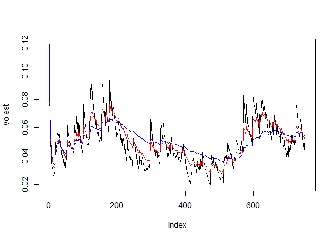

# Untitled
Chris Boomhower  
July 20, 2016  


```r
library(tseries)

agioData <- get.hist.quote('AGIO',quote = "Close") #Import AGIO ticker data
```

```
## Warning in download.file(url, destfile, method = method, quiet = quiet):
## downloaded length 47716 != reported length 200
```

```
## time series starts 2013-07-24
```

```r
length(agioData) #Check length od imported data
```

```
## [1] 753
```

```r
head(agioData)   #Check first few rows of imported data
```

```
##            Close
## 2013-07-24 31.28
## 2013-07-25 27.78
## 2013-07-26 28.53
## 2013-07-29 28.64
## 2013-07-30 29.10
## 2013-07-31 29.16
```

```r
agioLog <- log(lag(agioData)) - log(agioData) #Calculate the log returns of this data set
length(agioLog)  #log return calculation expected to reduce length of data by 1 due to subtraction
```

```
## [1] 752
```

```r
head(agioLog)    #Check first few rows of log return data
```

```
##                    Close
## 2013-07-24 -0.1186625743
## 2013-07-25  0.0266398270
## 2013-07-26  0.0038481069
## 2013-07-29  0.0159338670
## 2013-07-30  0.0020597330
## 2013-07-31 -0.0003429943
```

```r
agioVol <- sd(agioLog) * sqrt(250) * 100 #Calculate the volatility (estimate for overall volatility of AGIO); roughly 250 trading days in a year and multiply by 100 for percentage
agioVol
```

```
## [1] 81.30567
```

```r
## #Function to calculate volatility in continuous lookback (Courtesy of Dr. McGee)
Vol <- function(d, logrets){ #d is number of values back in time
    var = 0
    lam = 0 #exponential weight that is multiplied to each return
    varlist <- c()
    for(r in logrets){
        lam = lam*(1-1/d)+1
        var = (1-1/lam)*var+(1/lam)*r^2
        varlist <- c(varlist, var)
    }
    sqrt(varlist)
}

#Calculate estimated volatility with different weights
volest <- Vol(10,agioLog)
summary(volest)
```

```
##    Min. 1st Qu.  Median    Mean 3rd Qu.    Max. 
## 0.01936 0.03812 0.04760 0.04928 0.05873 0.11870
```

```r
volest2 <- Vol(30,agioLog)
summary(volest2)
```

```
##    Min. 1st Qu.  Median    Mean 3rd Qu.    Max. 
## 0.02751 0.04093 0.04945 0.04999 0.05935 0.11870
```

```r
volest3 <- Vol(100, agioLog)
summary(volest3)
```

```
##    Min. 1st Qu.  Median    Mean 3rd Qu.    Max. 
## 0.03279 0.04443 0.05049 0.05046 0.05655 0.11870
```

```r
plot(volest, type = "l") #High peaks correspond to significant fluctuations in AGIO at that time
lines(volest2, type = "l",col = "red")
lines(volest3, type = "l",col = "blue")
```

<!-- -->
