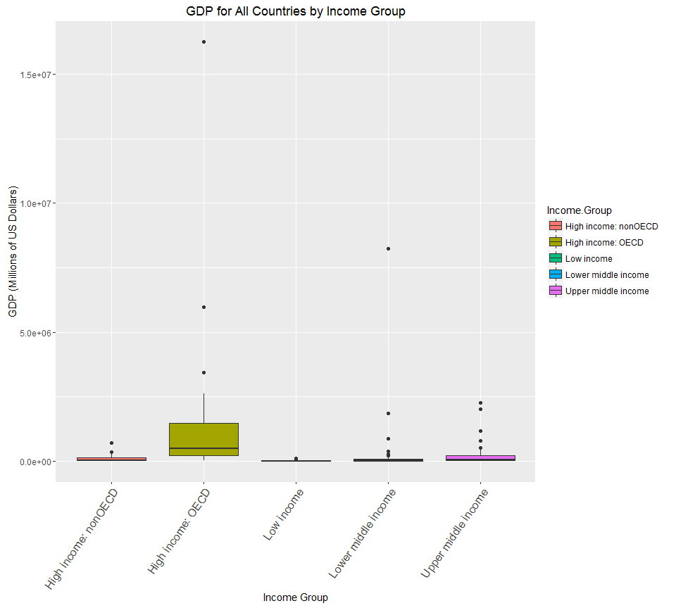
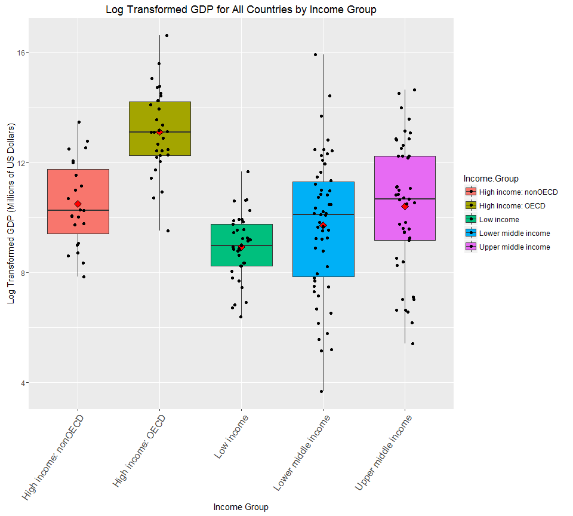

# A Study of Country Income Classification with Respect to GDP
Chris Boomhower  
June 18, 2016  
# Introduction

#### Even the simplest of data can often provide meaningful insights when cleaned, merged, and analyzed in the right way. So is the case for the Worldbank.org's country GDP ranking and country education data sets. Both are independent data sets providing different types of data for more or less the same countries (How closely these data sets match up will be discussed further in this study). By cleaning and merging these data, the relationships between country income group classification and GDP ranking may be assessed. Specifically, the data within this study are tidied and merged to answer the following five questions:

#### 1. Match the data based on the country shortcode. How many of the IDs match?
#### 2. Sort the data frame in ascending order by GDP (so United States is last). What is the 13th country in the resulting data frame?
#### 3. What are the average GDP rankings for the "High income: OECD" and "High income: nonOECD" groups?
#### 4. Plot the GDP for all of the countries. Use ggplot2 to color your plot by Income.Group.
#### 5. Cut the GDP ranking into 5 separate quantile groups. Make a table versus Income.Group. How many countries are lower middle income but among the 38 nations with the highest GDP?

#### As already mentioned, the data sets must be cleaned and merged before these questions may even be discussed. To do this, the GDP data is downloaded, imported, and cleaned first, followed second by the education data which is downloaded, imported, and cleaned in a similar fashion.

#### The *downloader*, *dplyr*, *ggplot2*, and *knitr* libraries are required to carry out this study.


```r
knitr::opts_chunk$set(echo=TRUE)
require(downloader)
require(dplyr)
require(ggplot2)
require(knitr)
```

_________________________________________

# Methods

### GDP Data: Download and Importation

#### The Gross Domestic Product data set is comprised of 2012 GDP values for various countries throughout the world. More recent data is hosted on Worldbank.org's website at http://data.worldbank.org/data-catalog/GDP-ranking-table.

#### For this analysis, however, the 2012 data hosted at cloudfront.net is of particular interest. As such, the 2012 data at https://d396qusza40orc.cloudfront.net/getdata%2Fdata%2FGDP.csv is downloaded.


```r
## Download data
prodURL <- "https://d396qusza40orc.cloudfront.net/getdata%2Fdata%2FGDP.csv"

download(prodURL, destfile = "GrossDomesticProduct.csv")

list.files() # Confirm download to working directory
```

```
## [1] "CBoomhower_CaseStudyUnit6.Rmd" "GrossDomesticProduct.csv"
```

<br>

#### Once the data is dowloaded to R's working directory, it is ready to be imported into the R environment as a data frame. After importation, its internal structure details and beginning and ending rows are observed to determine what actions to take when tidying the data. The last 100 rows from the data are observed since the raw data set contains as many as 95 irrelevant rows in its tail end. These last 100 rows are displayed in table form to shorten the output length.


```r
## Import Gross Domestic Product data and review raw data
productRaw <- read.csv("GrossDomesticProduct.csv", stringsAsFactors = FALSE, header = FALSE) # Try reading characters in as strings instead of factors for easier manipulation
str(productRaw) # Review raw data internal structure details
```

```
## 'data.frame':	331 obs. of  10 variables:
##  $ V1 : chr  "" "" "" "" ...
##  $ V2 : chr  "Gross domestic product 2012" "" "" "Ranking" ...
##  $ V3 : logi  NA NA NA NA NA NA ...
##  $ V4 : chr  "" "" "" "Economy" ...
##  $ V5 : chr  "" "" "(millions of" "US dollars)" ...
##  $ V6 : chr  "" "" "" "" ...
##  $ V7 : logi  NA NA NA NA NA NA ...
##  $ V8 : logi  NA NA NA NA NA NA ...
##  $ V9 : logi  NA NA NA NA NA NA ...
##  $ V10: logi  NA NA NA NA NA NA ...
```

```r
head(productRaw) # Review beginning rows to look for irrelevant entries
```

```
##    V1                          V2 V3            V4           V5 V6 V7 V8
## 1     Gross domestic product 2012 NA                               NA NA
## 2                                 NA                               NA NA
## 3                                 NA               (millions of    NA NA
## 4                         Ranking NA       Economy  US dollars)    NA NA
## 5                                 NA                               NA NA
## 6 USA                           1 NA United States  16,244,600     NA NA
##   V9 V10
## 1 NA  NA
## 2 NA  NA
## 3 NA  NA
## 4 NA  NA
## 5 NA  NA
## 6 NA  NA
```

```r
kable(tail(productRaw, 100), format = "html", caption = "Last 100 Rows of Raw GDP data", align = 'l', row.names = TRUE) # Review ending rows to look for irrelevant entries; kable output to reduce output space required in Markdown
```

<table>
<caption>Last 100 Rows of Raw GDP data</caption>
 <thead>
  <tr>
   <th style="text-align:left;">   </th>
   <th style="text-align:left;"> V1 </th>
   <th style="text-align:left;"> V2 </th>
   <th style="text-align:left;"> V3 </th>
   <th style="text-align:left;"> V4 </th>
   <th style="text-align:left;"> V5 </th>
   <th style="text-align:left;"> V6 </th>
   <th style="text-align:left;"> V7 </th>
   <th style="text-align:left;"> V8 </th>
   <th style="text-align:left;"> V9 </th>
   <th style="text-align:left;"> V10 </th>
  </tr>
 </thead>
<tbody>
  <tr>
   <td style="text-align:left;"> 232 </td>
   <td style="text-align:left;"> MNA </td>
   <td style="text-align:left;">  </td>
   <td style="text-align:left;"> NA </td>
   <td style="text-align:left;"> Middle East &amp; North Africa </td>
   <td style="text-align:left;"> 1,540,807 </td>
   <td style="text-align:left;">  </td>
   <td style="text-align:left;"> NA </td>
   <td style="text-align:left;"> NA </td>
   <td style="text-align:left;"> NA </td>
   <td style="text-align:left;"> NA </td>
  </tr>
  <tr>
   <td style="text-align:left;"> 233 </td>
   <td style="text-align:left;"> SAS </td>
   <td style="text-align:left;">  </td>
   <td style="text-align:left;"> NA </td>
   <td style="text-align:left;"> South Asia </td>
   <td style="text-align:left;"> 2,286,093 </td>
   <td style="text-align:left;">  </td>
   <td style="text-align:left;"> NA </td>
   <td style="text-align:left;"> NA </td>
   <td style="text-align:left;"> NA </td>
   <td style="text-align:left;"> NA </td>
  </tr>
  <tr>
   <td style="text-align:left;"> 234 </td>
   <td style="text-align:left;"> SSA </td>
   <td style="text-align:left;">  </td>
   <td style="text-align:left;"> NA </td>
   <td style="text-align:left;"> Sub-Saharan Africa </td>
   <td style="text-align:left;"> 1,289,813 </td>
   <td style="text-align:left;">  </td>
   <td style="text-align:left;"> NA </td>
   <td style="text-align:left;"> NA </td>
   <td style="text-align:left;"> NA </td>
   <td style="text-align:left;"> NA </td>
  </tr>
  <tr>
   <td style="text-align:left;"> 235 </td>
   <td style="text-align:left;"> HIC </td>
   <td style="text-align:left;">  </td>
   <td style="text-align:left;"> NA </td>
   <td style="text-align:left;"> High income </td>
   <td style="text-align:left;"> 49,717,634 </td>
   <td style="text-align:left;">  </td>
   <td style="text-align:left;"> NA </td>
   <td style="text-align:left;"> NA </td>
   <td style="text-align:left;"> NA </td>
   <td style="text-align:left;"> NA </td>
  </tr>
  <tr>
   <td style="text-align:left;"> 236 </td>
   <td style="text-align:left;"> EMU </td>
   <td style="text-align:left;">  </td>
   <td style="text-align:left;"> NA </td>
   <td style="text-align:left;"> Euro area </td>
   <td style="text-align:left;"> 12,192,344 </td>
   <td style="text-align:left;">  </td>
   <td style="text-align:left;"> NA </td>
   <td style="text-align:left;"> NA </td>
   <td style="text-align:left;"> NA </td>
   <td style="text-align:left;"> NA </td>
  </tr>
  <tr>
   <td style="text-align:left;"> 237 </td>
   <td style="text-align:left;">  </td>
   <td style="text-align:left;">  </td>
   <td style="text-align:left;"> NA </td>
   <td style="text-align:left;">  </td>
   <td style="text-align:left;">  </td>
   <td style="text-align:left;">  </td>
   <td style="text-align:left;"> NA </td>
   <td style="text-align:left;"> NA </td>
   <td style="text-align:left;"> NA </td>
   <td style="text-align:left;"> NA </td>
  </tr>
  <tr>
   <td style="text-align:left;"> 238 </td>
   <td style="text-align:left;">  </td>
   <td style="text-align:left;"> .. Not available. </td>
   <td style="text-align:left;"> NA </td>
   <td style="text-align:left;">  </td>
   <td style="text-align:left;">  </td>
   <td style="text-align:left;">  </td>
   <td style="text-align:left;"> NA </td>
   <td style="text-align:left;"> NA </td>
   <td style="text-align:left;"> NA </td>
   <td style="text-align:left;"> NA </td>
  </tr>
  <tr>
   <td style="text-align:left;"> 239 </td>
   <td style="text-align:left;">  </td>
   <td style="text-align:left;"> Note: Rankings include only those economies with confirmed GDP estimates. Figures in italics are for 2011 or 2010. </td>
   <td style="text-align:left;"> NA </td>
   <td style="text-align:left;">  </td>
   <td style="text-align:left;">  </td>
   <td style="text-align:left;">  </td>
   <td style="text-align:left;"> NA </td>
   <td style="text-align:left;"> NA </td>
   <td style="text-align:left;"> NA </td>
   <td style="text-align:left;"> NA </td>
  </tr>
  <tr>
   <td style="text-align:left;"> 240 </td>
   <td style="text-align:left;">  </td>
   <td style="text-align:left;"> a. Includes Former Spanish Sahara.  b. Excludes South Sudan  c. Covers mainland Tanzania only. d. Data are for the area </td>
   <td style="text-align:left;"> NA </td>
   <td style="text-align:left;">  </td>
   <td style="text-align:left;">  </td>
   <td style="text-align:left;">  </td>
   <td style="text-align:left;"> NA </td>
   <td style="text-align:left;"> NA </td>
   <td style="text-align:left;"> NA </td>
   <td style="text-align:left;"> NA </td>
  </tr>
  <tr>
   <td style="text-align:left;"> 241 </td>
   <td style="text-align:left;">  </td>
   <td style="text-align:left;"> controlled by the government of the Republic of Cyprus.   e. Excludes Abkhazia and South Ossetia.  f. Excludes Transnistria. </td>
   <td style="text-align:left;"> NA </td>
   <td style="text-align:left;">  </td>
   <td style="text-align:left;">  </td>
   <td style="text-align:left;">  </td>
   <td style="text-align:left;"> NA </td>
   <td style="text-align:left;"> NA </td>
   <td style="text-align:left;"> NA </td>
   <td style="text-align:left;"> NA </td>
  </tr>
  <tr>
   <td style="text-align:left;"> 242 </td>
   <td style="text-align:left;">  </td>
   <td style="text-align:left;">  </td>
   <td style="text-align:left;"> NA </td>
   <td style="text-align:left;">  </td>
   <td style="text-align:left;">  </td>
   <td style="text-align:left;">  </td>
   <td style="text-align:left;"> NA </td>
   <td style="text-align:left;"> NA </td>
   <td style="text-align:left;"> NA </td>
   <td style="text-align:left;"> NA </td>
  </tr>
  <tr>
   <td style="text-align:left;"> 243 </td>
   <td style="text-align:left;">  </td>
   <td style="text-align:left;">  </td>
   <td style="text-align:left;"> NA </td>
   <td style="text-align:left;">  </td>
   <td style="text-align:left;">  </td>
   <td style="text-align:left;">  </td>
   <td style="text-align:left;"> NA </td>
   <td style="text-align:left;"> NA </td>
   <td style="text-align:left;"> NA </td>
   <td style="text-align:left;"> NA </td>
  </tr>
  <tr>
   <td style="text-align:left;"> 244 </td>
   <td style="text-align:left;">  </td>
   <td style="text-align:left;">  </td>
   <td style="text-align:left;"> NA </td>
   <td style="text-align:left;">  </td>
   <td style="text-align:left;">  </td>
   <td style="text-align:left;">  </td>
   <td style="text-align:left;"> NA </td>
   <td style="text-align:left;"> NA </td>
   <td style="text-align:left;"> NA </td>
   <td style="text-align:left;"> NA </td>
  </tr>
  <tr>
   <td style="text-align:left;"> 245 </td>
   <td style="text-align:left;">  </td>
   <td style="text-align:left;">  </td>
   <td style="text-align:left;"> NA </td>
   <td style="text-align:left;">  </td>
   <td style="text-align:left;">  </td>
   <td style="text-align:left;">  </td>
   <td style="text-align:left;"> NA </td>
   <td style="text-align:left;"> NA </td>
   <td style="text-align:left;"> NA </td>
   <td style="text-align:left;"> NA </td>
  </tr>
  <tr>
   <td style="text-align:left;"> 246 </td>
   <td style="text-align:left;">  </td>
   <td style="text-align:left;">  </td>
   <td style="text-align:left;"> NA </td>
   <td style="text-align:left;">  </td>
   <td style="text-align:left;">  </td>
   <td style="text-align:left;">  </td>
   <td style="text-align:left;"> NA </td>
   <td style="text-align:left;"> NA </td>
   <td style="text-align:left;"> NA </td>
   <td style="text-align:left;"> NA </td>
  </tr>
  <tr>
   <td style="text-align:left;"> 247 </td>
   <td style="text-align:left;">  </td>
   <td style="text-align:left;">  </td>
   <td style="text-align:left;"> NA </td>
   <td style="text-align:left;">  </td>
   <td style="text-align:left;">  </td>
   <td style="text-align:left;">  </td>
   <td style="text-align:left;"> NA </td>
   <td style="text-align:left;"> NA </td>
   <td style="text-align:left;"> NA </td>
   <td style="text-align:left;"> NA </td>
  </tr>
  <tr>
   <td style="text-align:left;"> 248 </td>
   <td style="text-align:left;">  </td>
   <td style="text-align:left;">  </td>
   <td style="text-align:left;"> NA </td>
   <td style="text-align:left;">  </td>
   <td style="text-align:left;">  </td>
   <td style="text-align:left;">  </td>
   <td style="text-align:left;"> NA </td>
   <td style="text-align:left;"> NA </td>
   <td style="text-align:left;"> NA </td>
   <td style="text-align:left;"> NA </td>
  </tr>
  <tr>
   <td style="text-align:left;"> 249 </td>
   <td style="text-align:left;">  </td>
   <td style="text-align:left;">  </td>
   <td style="text-align:left;"> NA </td>
   <td style="text-align:left;">  </td>
   <td style="text-align:left;">  </td>
   <td style="text-align:left;">  </td>
   <td style="text-align:left;"> NA </td>
   <td style="text-align:left;"> NA </td>
   <td style="text-align:left;"> NA </td>
   <td style="text-align:left;"> NA </td>
  </tr>
  <tr>
   <td style="text-align:left;"> 250 </td>
   <td style="text-align:left;">  </td>
   <td style="text-align:left;">  </td>
   <td style="text-align:left;"> NA </td>
   <td style="text-align:left;">  </td>
   <td style="text-align:left;">  </td>
   <td style="text-align:left;">  </td>
   <td style="text-align:left;"> NA </td>
   <td style="text-align:left;"> NA </td>
   <td style="text-align:left;"> NA </td>
   <td style="text-align:left;"> NA </td>
  </tr>
  <tr>
   <td style="text-align:left;"> 251 </td>
   <td style="text-align:left;">  </td>
   <td style="text-align:left;">  </td>
   <td style="text-align:left;"> NA </td>
   <td style="text-align:left;">  </td>
   <td style="text-align:left;">  </td>
   <td style="text-align:left;">  </td>
   <td style="text-align:left;"> NA </td>
   <td style="text-align:left;"> NA </td>
   <td style="text-align:left;"> NA </td>
   <td style="text-align:left;"> NA </td>
  </tr>
  <tr>
   <td style="text-align:left;"> 252 </td>
   <td style="text-align:left;">  </td>
   <td style="text-align:left;">  </td>
   <td style="text-align:left;"> NA </td>
   <td style="text-align:left;">  </td>
   <td style="text-align:left;">  </td>
   <td style="text-align:left;">  </td>
   <td style="text-align:left;"> NA </td>
   <td style="text-align:left;"> NA </td>
   <td style="text-align:left;"> NA </td>
   <td style="text-align:left;"> NA </td>
  </tr>
  <tr>
   <td style="text-align:left;"> 253 </td>
   <td style="text-align:left;">  </td>
   <td style="text-align:left;">  </td>
   <td style="text-align:left;"> NA </td>
   <td style="text-align:left;">  </td>
   <td style="text-align:left;">  </td>
   <td style="text-align:left;">  </td>
   <td style="text-align:left;"> NA </td>
   <td style="text-align:left;"> NA </td>
   <td style="text-align:left;"> NA </td>
   <td style="text-align:left;"> NA </td>
  </tr>
  <tr>
   <td style="text-align:left;"> 254 </td>
   <td style="text-align:left;">  </td>
   <td style="text-align:left;">  </td>
   <td style="text-align:left;"> NA </td>
   <td style="text-align:left;">  </td>
   <td style="text-align:left;">  </td>
   <td style="text-align:left;">  </td>
   <td style="text-align:left;"> NA </td>
   <td style="text-align:left;"> NA </td>
   <td style="text-align:left;"> NA </td>
   <td style="text-align:left;"> NA </td>
  </tr>
  <tr>
   <td style="text-align:left;"> 255 </td>
   <td style="text-align:left;">  </td>
   <td style="text-align:left;">  </td>
   <td style="text-align:left;"> NA </td>
   <td style="text-align:left;">  </td>
   <td style="text-align:left;">  </td>
   <td style="text-align:left;">  </td>
   <td style="text-align:left;"> NA </td>
   <td style="text-align:left;"> NA </td>
   <td style="text-align:left;"> NA </td>
   <td style="text-align:left;"> NA </td>
  </tr>
  <tr>
   <td style="text-align:left;"> 256 </td>
   <td style="text-align:left;">  </td>
   <td style="text-align:left;">  </td>
   <td style="text-align:left;"> NA </td>
   <td style="text-align:left;">  </td>
   <td style="text-align:left;">  </td>
   <td style="text-align:left;">  </td>
   <td style="text-align:left;"> NA </td>
   <td style="text-align:left;"> NA </td>
   <td style="text-align:left;"> NA </td>
   <td style="text-align:left;"> NA </td>
  </tr>
  <tr>
   <td style="text-align:left;"> 257 </td>
   <td style="text-align:left;">  </td>
   <td style="text-align:left;">  </td>
   <td style="text-align:left;"> NA </td>
   <td style="text-align:left;">  </td>
   <td style="text-align:left;">  </td>
   <td style="text-align:left;">  </td>
   <td style="text-align:left;"> NA </td>
   <td style="text-align:left;"> NA </td>
   <td style="text-align:left;"> NA </td>
   <td style="text-align:left;"> NA </td>
  </tr>
  <tr>
   <td style="text-align:left;"> 258 </td>
   <td style="text-align:left;">  </td>
   <td style="text-align:left;">  </td>
   <td style="text-align:left;"> NA </td>
   <td style="text-align:left;">  </td>
   <td style="text-align:left;">  </td>
   <td style="text-align:left;">  </td>
   <td style="text-align:left;"> NA </td>
   <td style="text-align:left;"> NA </td>
   <td style="text-align:left;"> NA </td>
   <td style="text-align:left;"> NA </td>
  </tr>
  <tr>
   <td style="text-align:left;"> 259 </td>
   <td style="text-align:left;">  </td>
   <td style="text-align:left;">  </td>
   <td style="text-align:left;"> NA </td>
   <td style="text-align:left;">  </td>
   <td style="text-align:left;">  </td>
   <td style="text-align:left;">  </td>
   <td style="text-align:left;"> NA </td>
   <td style="text-align:left;"> NA </td>
   <td style="text-align:left;"> NA </td>
   <td style="text-align:left;"> NA </td>
  </tr>
  <tr>
   <td style="text-align:left;"> 260 </td>
   <td style="text-align:left;">  </td>
   <td style="text-align:left;">  </td>
   <td style="text-align:left;"> NA </td>
   <td style="text-align:left;">  </td>
   <td style="text-align:left;">  </td>
   <td style="text-align:left;">  </td>
   <td style="text-align:left;"> NA </td>
   <td style="text-align:left;"> NA </td>
   <td style="text-align:left;"> NA </td>
   <td style="text-align:left;"> NA </td>
  </tr>
  <tr>
   <td style="text-align:left;"> 261 </td>
   <td style="text-align:left;">  </td>
   <td style="text-align:left;">  </td>
   <td style="text-align:left;"> NA </td>
   <td style="text-align:left;">  </td>
   <td style="text-align:left;">  </td>
   <td style="text-align:left;">  </td>
   <td style="text-align:left;"> NA </td>
   <td style="text-align:left;"> NA </td>
   <td style="text-align:left;"> NA </td>
   <td style="text-align:left;"> NA </td>
  </tr>
  <tr>
   <td style="text-align:left;"> 262 </td>
   <td style="text-align:left;">  </td>
   <td style="text-align:left;">  </td>
   <td style="text-align:left;"> NA </td>
   <td style="text-align:left;">  </td>
   <td style="text-align:left;">  </td>
   <td style="text-align:left;">  </td>
   <td style="text-align:left;"> NA </td>
   <td style="text-align:left;"> NA </td>
   <td style="text-align:left;"> NA </td>
   <td style="text-align:left;"> NA </td>
  </tr>
  <tr>
   <td style="text-align:left;"> 263 </td>
   <td style="text-align:left;">  </td>
   <td style="text-align:left;">  </td>
   <td style="text-align:left;"> NA </td>
   <td style="text-align:left;">  </td>
   <td style="text-align:left;">  </td>
   <td style="text-align:left;">  </td>
   <td style="text-align:left;"> NA </td>
   <td style="text-align:left;"> NA </td>
   <td style="text-align:left;"> NA </td>
   <td style="text-align:left;"> NA </td>
  </tr>
  <tr>
   <td style="text-align:left;"> 264 </td>
   <td style="text-align:left;">  </td>
   <td style="text-align:left;">  </td>
   <td style="text-align:left;"> NA </td>
   <td style="text-align:left;">  </td>
   <td style="text-align:left;">  </td>
   <td style="text-align:left;">  </td>
   <td style="text-align:left;"> NA </td>
   <td style="text-align:left;"> NA </td>
   <td style="text-align:left;"> NA </td>
   <td style="text-align:left;"> NA </td>
  </tr>
  <tr>
   <td style="text-align:left;"> 265 </td>
   <td style="text-align:left;">  </td>
   <td style="text-align:left;">  </td>
   <td style="text-align:left;"> NA </td>
   <td style="text-align:left;">  </td>
   <td style="text-align:left;">  </td>
   <td style="text-align:left;">  </td>
   <td style="text-align:left;"> NA </td>
   <td style="text-align:left;"> NA </td>
   <td style="text-align:left;"> NA </td>
   <td style="text-align:left;"> NA </td>
  </tr>
  <tr>
   <td style="text-align:left;"> 266 </td>
   <td style="text-align:left;">  </td>
   <td style="text-align:left;">  </td>
   <td style="text-align:left;"> NA </td>
   <td style="text-align:left;">  </td>
   <td style="text-align:left;">  </td>
   <td style="text-align:left;">  </td>
   <td style="text-align:left;"> NA </td>
   <td style="text-align:left;"> NA </td>
   <td style="text-align:left;"> NA </td>
   <td style="text-align:left;"> NA </td>
  </tr>
  <tr>
   <td style="text-align:left;"> 267 </td>
   <td style="text-align:left;">  </td>
   <td style="text-align:left;">  </td>
   <td style="text-align:left;"> NA </td>
   <td style="text-align:left;">  </td>
   <td style="text-align:left;">  </td>
   <td style="text-align:left;">  </td>
   <td style="text-align:left;"> NA </td>
   <td style="text-align:left;"> NA </td>
   <td style="text-align:left;"> NA </td>
   <td style="text-align:left;"> NA </td>
  </tr>
  <tr>
   <td style="text-align:left;"> 268 </td>
   <td style="text-align:left;">  </td>
   <td style="text-align:left;">  </td>
   <td style="text-align:left;"> NA </td>
   <td style="text-align:left;">  </td>
   <td style="text-align:left;">  </td>
   <td style="text-align:left;">  </td>
   <td style="text-align:left;"> NA </td>
   <td style="text-align:left;"> NA </td>
   <td style="text-align:left;"> NA </td>
   <td style="text-align:left;"> NA </td>
  </tr>
  <tr>
   <td style="text-align:left;"> 269 </td>
   <td style="text-align:left;">  </td>
   <td style="text-align:left;">  </td>
   <td style="text-align:left;"> NA </td>
   <td style="text-align:left;">  </td>
   <td style="text-align:left;">  </td>
   <td style="text-align:left;">  </td>
   <td style="text-align:left;"> NA </td>
   <td style="text-align:left;"> NA </td>
   <td style="text-align:left;"> NA </td>
   <td style="text-align:left;"> NA </td>
  </tr>
  <tr>
   <td style="text-align:left;"> 270 </td>
   <td style="text-align:left;">  </td>
   <td style="text-align:left;">  </td>
   <td style="text-align:left;"> NA </td>
   <td style="text-align:left;">  </td>
   <td style="text-align:left;">  </td>
   <td style="text-align:left;">  </td>
   <td style="text-align:left;"> NA </td>
   <td style="text-align:left;"> NA </td>
   <td style="text-align:left;"> NA </td>
   <td style="text-align:left;"> NA </td>
  </tr>
  <tr>
   <td style="text-align:left;"> 271 </td>
   <td style="text-align:left;">  </td>
   <td style="text-align:left;">  </td>
   <td style="text-align:left;"> NA </td>
   <td style="text-align:left;">  </td>
   <td style="text-align:left;">  </td>
   <td style="text-align:left;">  </td>
   <td style="text-align:left;"> NA </td>
   <td style="text-align:left;"> NA </td>
   <td style="text-align:left;"> NA </td>
   <td style="text-align:left;"> NA </td>
  </tr>
  <tr>
   <td style="text-align:left;"> 272 </td>
   <td style="text-align:left;">  </td>
   <td style="text-align:left;">  </td>
   <td style="text-align:left;"> NA </td>
   <td style="text-align:left;">  </td>
   <td style="text-align:left;">  </td>
   <td style="text-align:left;">  </td>
   <td style="text-align:left;"> NA </td>
   <td style="text-align:left;"> NA </td>
   <td style="text-align:left;"> NA </td>
   <td style="text-align:left;"> NA </td>
  </tr>
  <tr>
   <td style="text-align:left;"> 273 </td>
   <td style="text-align:left;">  </td>
   <td style="text-align:left;">  </td>
   <td style="text-align:left;"> NA </td>
   <td style="text-align:left;">  </td>
   <td style="text-align:left;">  </td>
   <td style="text-align:left;">  </td>
   <td style="text-align:left;"> NA </td>
   <td style="text-align:left;"> NA </td>
   <td style="text-align:left;"> NA </td>
   <td style="text-align:left;"> NA </td>
  </tr>
  <tr>
   <td style="text-align:left;"> 274 </td>
   <td style="text-align:left;">  </td>
   <td style="text-align:left;">  </td>
   <td style="text-align:left;"> NA </td>
   <td style="text-align:left;">  </td>
   <td style="text-align:left;">  </td>
   <td style="text-align:left;">  </td>
   <td style="text-align:left;"> NA </td>
   <td style="text-align:left;"> NA </td>
   <td style="text-align:left;"> NA </td>
   <td style="text-align:left;"> NA </td>
  </tr>
  <tr>
   <td style="text-align:left;"> 275 </td>
   <td style="text-align:left;">  </td>
   <td style="text-align:left;">  </td>
   <td style="text-align:left;"> NA </td>
   <td style="text-align:left;">  </td>
   <td style="text-align:left;">  </td>
   <td style="text-align:left;">  </td>
   <td style="text-align:left;"> NA </td>
   <td style="text-align:left;"> NA </td>
   <td style="text-align:left;"> NA </td>
   <td style="text-align:left;"> NA </td>
  </tr>
  <tr>
   <td style="text-align:left;"> 276 </td>
   <td style="text-align:left;">  </td>
   <td style="text-align:left;">  </td>
   <td style="text-align:left;"> NA </td>
   <td style="text-align:left;">  </td>
   <td style="text-align:left;">  </td>
   <td style="text-align:left;">  </td>
   <td style="text-align:left;"> NA </td>
   <td style="text-align:left;"> NA </td>
   <td style="text-align:left;"> NA </td>
   <td style="text-align:left;"> NA </td>
  </tr>
  <tr>
   <td style="text-align:left;"> 277 </td>
   <td style="text-align:left;">  </td>
   <td style="text-align:left;">  </td>
   <td style="text-align:left;"> NA </td>
   <td style="text-align:left;">  </td>
   <td style="text-align:left;">  </td>
   <td style="text-align:left;">  </td>
   <td style="text-align:left;"> NA </td>
   <td style="text-align:left;"> NA </td>
   <td style="text-align:left;"> NA </td>
   <td style="text-align:left;"> NA </td>
  </tr>
  <tr>
   <td style="text-align:left;"> 278 </td>
   <td style="text-align:left;">  </td>
   <td style="text-align:left;">  </td>
   <td style="text-align:left;"> NA </td>
   <td style="text-align:left;">  </td>
   <td style="text-align:left;">  </td>
   <td style="text-align:left;">  </td>
   <td style="text-align:left;"> NA </td>
   <td style="text-align:left;"> NA </td>
   <td style="text-align:left;"> NA </td>
   <td style="text-align:left;"> NA </td>
  </tr>
  <tr>
   <td style="text-align:left;"> 279 </td>
   <td style="text-align:left;">  </td>
   <td style="text-align:left;">  </td>
   <td style="text-align:left;"> NA </td>
   <td style="text-align:left;">  </td>
   <td style="text-align:left;">  </td>
   <td style="text-align:left;">  </td>
   <td style="text-align:left;"> NA </td>
   <td style="text-align:left;"> NA </td>
   <td style="text-align:left;"> NA </td>
   <td style="text-align:left;"> NA </td>
  </tr>
  <tr>
   <td style="text-align:left;"> 280 </td>
   <td style="text-align:left;">  </td>
   <td style="text-align:left;">  </td>
   <td style="text-align:left;"> NA </td>
   <td style="text-align:left;">  </td>
   <td style="text-align:left;">  </td>
   <td style="text-align:left;">  </td>
   <td style="text-align:left;"> NA </td>
   <td style="text-align:left;"> NA </td>
   <td style="text-align:left;"> NA </td>
   <td style="text-align:left;"> NA </td>
  </tr>
  <tr>
   <td style="text-align:left;"> 281 </td>
   <td style="text-align:left;">  </td>
   <td style="text-align:left;">  </td>
   <td style="text-align:left;"> NA </td>
   <td style="text-align:left;">  </td>
   <td style="text-align:left;">  </td>
   <td style="text-align:left;">  </td>
   <td style="text-align:left;"> NA </td>
   <td style="text-align:left;"> NA </td>
   <td style="text-align:left;"> NA </td>
   <td style="text-align:left;"> NA </td>
  </tr>
  <tr>
   <td style="text-align:left;"> 282 </td>
   <td style="text-align:left;">  </td>
   <td style="text-align:left;">  </td>
   <td style="text-align:left;"> NA </td>
   <td style="text-align:left;">  </td>
   <td style="text-align:left;">  </td>
   <td style="text-align:left;">  </td>
   <td style="text-align:left;"> NA </td>
   <td style="text-align:left;"> NA </td>
   <td style="text-align:left;"> NA </td>
   <td style="text-align:left;"> NA </td>
  </tr>
  <tr>
   <td style="text-align:left;"> 283 </td>
   <td style="text-align:left;">  </td>
   <td style="text-align:left;">  </td>
   <td style="text-align:left;"> NA </td>
   <td style="text-align:left;">  </td>
   <td style="text-align:left;">  </td>
   <td style="text-align:left;">  </td>
   <td style="text-align:left;"> NA </td>
   <td style="text-align:left;"> NA </td>
   <td style="text-align:left;"> NA </td>
   <td style="text-align:left;"> NA </td>
  </tr>
  <tr>
   <td style="text-align:left;"> 284 </td>
   <td style="text-align:left;">  </td>
   <td style="text-align:left;">  </td>
   <td style="text-align:left;"> NA </td>
   <td style="text-align:left;">  </td>
   <td style="text-align:left;">  </td>
   <td style="text-align:left;">  </td>
   <td style="text-align:left;"> NA </td>
   <td style="text-align:left;"> NA </td>
   <td style="text-align:left;"> NA </td>
   <td style="text-align:left;"> NA </td>
  </tr>
  <tr>
   <td style="text-align:left;"> 285 </td>
   <td style="text-align:left;">  </td>
   <td style="text-align:left;">  </td>
   <td style="text-align:left;"> NA </td>
   <td style="text-align:left;">  </td>
   <td style="text-align:left;">  </td>
   <td style="text-align:left;">  </td>
   <td style="text-align:left;"> NA </td>
   <td style="text-align:left;"> NA </td>
   <td style="text-align:left;"> NA </td>
   <td style="text-align:left;"> NA </td>
  </tr>
  <tr>
   <td style="text-align:left;"> 286 </td>
   <td style="text-align:left;">  </td>
   <td style="text-align:left;">  </td>
   <td style="text-align:left;"> NA </td>
   <td style="text-align:left;">  </td>
   <td style="text-align:left;">  </td>
   <td style="text-align:left;">  </td>
   <td style="text-align:left;"> NA </td>
   <td style="text-align:left;"> NA </td>
   <td style="text-align:left;"> NA </td>
   <td style="text-align:left;"> NA </td>
  </tr>
  <tr>
   <td style="text-align:left;"> 287 </td>
   <td style="text-align:left;">  </td>
   <td style="text-align:left;">  </td>
   <td style="text-align:left;"> NA </td>
   <td style="text-align:left;">  </td>
   <td style="text-align:left;">  </td>
   <td style="text-align:left;">  </td>
   <td style="text-align:left;"> NA </td>
   <td style="text-align:left;"> NA </td>
   <td style="text-align:left;"> NA </td>
   <td style="text-align:left;"> NA </td>
  </tr>
  <tr>
   <td style="text-align:left;"> 288 </td>
   <td style="text-align:left;">  </td>
   <td style="text-align:left;">  </td>
   <td style="text-align:left;"> NA </td>
   <td style="text-align:left;">  </td>
   <td style="text-align:left;">  </td>
   <td style="text-align:left;">  </td>
   <td style="text-align:left;"> NA </td>
   <td style="text-align:left;"> NA </td>
   <td style="text-align:left;"> NA </td>
   <td style="text-align:left;"> NA </td>
  </tr>
  <tr>
   <td style="text-align:left;"> 289 </td>
   <td style="text-align:left;">  </td>
   <td style="text-align:left;">  </td>
   <td style="text-align:left;"> NA </td>
   <td style="text-align:left;">  </td>
   <td style="text-align:left;">  </td>
   <td style="text-align:left;">  </td>
   <td style="text-align:left;"> NA </td>
   <td style="text-align:left;"> NA </td>
   <td style="text-align:left;"> NA </td>
   <td style="text-align:left;"> NA </td>
  </tr>
  <tr>
   <td style="text-align:left;"> 290 </td>
   <td style="text-align:left;">  </td>
   <td style="text-align:left;">  </td>
   <td style="text-align:left;"> NA </td>
   <td style="text-align:left;">  </td>
   <td style="text-align:left;">  </td>
   <td style="text-align:left;">  </td>
   <td style="text-align:left;"> NA </td>
   <td style="text-align:left;"> NA </td>
   <td style="text-align:left;"> NA </td>
   <td style="text-align:left;"> NA </td>
  </tr>
  <tr>
   <td style="text-align:left;"> 291 </td>
   <td style="text-align:left;">  </td>
   <td style="text-align:left;">  </td>
   <td style="text-align:left;"> NA </td>
   <td style="text-align:left;">  </td>
   <td style="text-align:left;">  </td>
   <td style="text-align:left;">  </td>
   <td style="text-align:left;"> NA </td>
   <td style="text-align:left;"> NA </td>
   <td style="text-align:left;"> NA </td>
   <td style="text-align:left;"> NA </td>
  </tr>
  <tr>
   <td style="text-align:left;"> 292 </td>
   <td style="text-align:left;">  </td>
   <td style="text-align:left;">  </td>
   <td style="text-align:left;"> NA </td>
   <td style="text-align:left;">  </td>
   <td style="text-align:left;">  </td>
   <td style="text-align:left;">  </td>
   <td style="text-align:left;"> NA </td>
   <td style="text-align:left;"> NA </td>
   <td style="text-align:left;"> NA </td>
   <td style="text-align:left;"> NA </td>
  </tr>
  <tr>
   <td style="text-align:left;"> 293 </td>
   <td style="text-align:left;">  </td>
   <td style="text-align:left;">  </td>
   <td style="text-align:left;"> NA </td>
   <td style="text-align:left;">  </td>
   <td style="text-align:left;">  </td>
   <td style="text-align:left;">  </td>
   <td style="text-align:left;"> NA </td>
   <td style="text-align:left;"> NA </td>
   <td style="text-align:left;"> NA </td>
   <td style="text-align:left;"> NA </td>
  </tr>
  <tr>
   <td style="text-align:left;"> 294 </td>
   <td style="text-align:left;">  </td>
   <td style="text-align:left;">  </td>
   <td style="text-align:left;"> NA </td>
   <td style="text-align:left;">  </td>
   <td style="text-align:left;">  </td>
   <td style="text-align:left;">  </td>
   <td style="text-align:left;"> NA </td>
   <td style="text-align:left;"> NA </td>
   <td style="text-align:left;"> NA </td>
   <td style="text-align:left;"> NA </td>
  </tr>
  <tr>
   <td style="text-align:left;"> 295 </td>
   <td style="text-align:left;">  </td>
   <td style="text-align:left;">  </td>
   <td style="text-align:left;"> NA </td>
   <td style="text-align:left;">  </td>
   <td style="text-align:left;">  </td>
   <td style="text-align:left;">  </td>
   <td style="text-align:left;"> NA </td>
   <td style="text-align:left;"> NA </td>
   <td style="text-align:left;"> NA </td>
   <td style="text-align:left;"> NA </td>
  </tr>
  <tr>
   <td style="text-align:left;"> 296 </td>
   <td style="text-align:left;">  </td>
   <td style="text-align:left;">  </td>
   <td style="text-align:left;"> NA </td>
   <td style="text-align:left;">  </td>
   <td style="text-align:left;">  </td>
   <td style="text-align:left;">  </td>
   <td style="text-align:left;"> NA </td>
   <td style="text-align:left;"> NA </td>
   <td style="text-align:left;"> NA </td>
   <td style="text-align:left;"> NA </td>
  </tr>
  <tr>
   <td style="text-align:left;"> 297 </td>
   <td style="text-align:left;">  </td>
   <td style="text-align:left;">  </td>
   <td style="text-align:left;"> NA </td>
   <td style="text-align:left;">  </td>
   <td style="text-align:left;">  </td>
   <td style="text-align:left;">  </td>
   <td style="text-align:left;"> NA </td>
   <td style="text-align:left;"> NA </td>
   <td style="text-align:left;"> NA </td>
   <td style="text-align:left;"> NA </td>
  </tr>
  <tr>
   <td style="text-align:left;"> 298 </td>
   <td style="text-align:left;">  </td>
   <td style="text-align:left;">  </td>
   <td style="text-align:left;"> NA </td>
   <td style="text-align:left;">  </td>
   <td style="text-align:left;">  </td>
   <td style="text-align:left;">  </td>
   <td style="text-align:left;"> NA </td>
   <td style="text-align:left;"> NA </td>
   <td style="text-align:left;"> NA </td>
   <td style="text-align:left;"> NA </td>
  </tr>
  <tr>
   <td style="text-align:left;"> 299 </td>
   <td style="text-align:left;">  </td>
   <td style="text-align:left;">  </td>
   <td style="text-align:left;"> NA </td>
   <td style="text-align:left;">  </td>
   <td style="text-align:left;">  </td>
   <td style="text-align:left;">  </td>
   <td style="text-align:left;"> NA </td>
   <td style="text-align:left;"> NA </td>
   <td style="text-align:left;"> NA </td>
   <td style="text-align:left;"> NA </td>
  </tr>
  <tr>
   <td style="text-align:left;"> 300 </td>
   <td style="text-align:left;">  </td>
   <td style="text-align:left;">  </td>
   <td style="text-align:left;"> NA </td>
   <td style="text-align:left;">  </td>
   <td style="text-align:left;">  </td>
   <td style="text-align:left;">  </td>
   <td style="text-align:left;"> NA </td>
   <td style="text-align:left;"> NA </td>
   <td style="text-align:left;"> NA </td>
   <td style="text-align:left;"> NA </td>
  </tr>
  <tr>
   <td style="text-align:left;"> 301 </td>
   <td style="text-align:left;">  </td>
   <td style="text-align:left;">  </td>
   <td style="text-align:left;"> NA </td>
   <td style="text-align:left;">  </td>
   <td style="text-align:left;">  </td>
   <td style="text-align:left;">  </td>
   <td style="text-align:left;"> NA </td>
   <td style="text-align:left;"> NA </td>
   <td style="text-align:left;"> NA </td>
   <td style="text-align:left;"> NA </td>
  </tr>
  <tr>
   <td style="text-align:left;"> 302 </td>
   <td style="text-align:left;">  </td>
   <td style="text-align:left;">  </td>
   <td style="text-align:left;"> NA </td>
   <td style="text-align:left;">  </td>
   <td style="text-align:left;">  </td>
   <td style="text-align:left;">  </td>
   <td style="text-align:left;"> NA </td>
   <td style="text-align:left;"> NA </td>
   <td style="text-align:left;"> NA </td>
   <td style="text-align:left;"> NA </td>
  </tr>
  <tr>
   <td style="text-align:left;"> 303 </td>
   <td style="text-align:left;">  </td>
   <td style="text-align:left;">  </td>
   <td style="text-align:left;"> NA </td>
   <td style="text-align:left;">  </td>
   <td style="text-align:left;">  </td>
   <td style="text-align:left;">  </td>
   <td style="text-align:left;"> NA </td>
   <td style="text-align:left;"> NA </td>
   <td style="text-align:left;"> NA </td>
   <td style="text-align:left;"> NA </td>
  </tr>
  <tr>
   <td style="text-align:left;"> 304 </td>
   <td style="text-align:left;">  </td>
   <td style="text-align:left;">  </td>
   <td style="text-align:left;"> NA </td>
   <td style="text-align:left;">  </td>
   <td style="text-align:left;">  </td>
   <td style="text-align:left;">  </td>
   <td style="text-align:left;"> NA </td>
   <td style="text-align:left;"> NA </td>
   <td style="text-align:left;"> NA </td>
   <td style="text-align:left;"> NA </td>
  </tr>
  <tr>
   <td style="text-align:left;"> 305 </td>
   <td style="text-align:left;">  </td>
   <td style="text-align:left;">  </td>
   <td style="text-align:left;"> NA </td>
   <td style="text-align:left;">  </td>
   <td style="text-align:left;">  </td>
   <td style="text-align:left;">  </td>
   <td style="text-align:left;"> NA </td>
   <td style="text-align:left;"> NA </td>
   <td style="text-align:left;"> NA </td>
   <td style="text-align:left;"> NA </td>
  </tr>
  <tr>
   <td style="text-align:left;"> 306 </td>
   <td style="text-align:left;">  </td>
   <td style="text-align:left;">  </td>
   <td style="text-align:left;"> NA </td>
   <td style="text-align:left;">  </td>
   <td style="text-align:left;">  </td>
   <td style="text-align:left;">  </td>
   <td style="text-align:left;"> NA </td>
   <td style="text-align:left;"> NA </td>
   <td style="text-align:left;"> NA </td>
   <td style="text-align:left;"> NA </td>
  </tr>
  <tr>
   <td style="text-align:left;"> 307 </td>
   <td style="text-align:left;">  </td>
   <td style="text-align:left;">  </td>
   <td style="text-align:left;"> NA </td>
   <td style="text-align:left;">  </td>
   <td style="text-align:left;">  </td>
   <td style="text-align:left;">  </td>
   <td style="text-align:left;"> NA </td>
   <td style="text-align:left;"> NA </td>
   <td style="text-align:left;"> NA </td>
   <td style="text-align:left;"> NA </td>
  </tr>
  <tr>
   <td style="text-align:left;"> 308 </td>
   <td style="text-align:left;">  </td>
   <td style="text-align:left;">  </td>
   <td style="text-align:left;"> NA </td>
   <td style="text-align:left;">  </td>
   <td style="text-align:left;">  </td>
   <td style="text-align:left;">  </td>
   <td style="text-align:left;"> NA </td>
   <td style="text-align:left;"> NA </td>
   <td style="text-align:left;"> NA </td>
   <td style="text-align:left;"> NA </td>
  </tr>
  <tr>
   <td style="text-align:left;"> 309 </td>
   <td style="text-align:left;">  </td>
   <td style="text-align:left;">  </td>
   <td style="text-align:left;"> NA </td>
   <td style="text-align:left;">  </td>
   <td style="text-align:left;">  </td>
   <td style="text-align:left;">  </td>
   <td style="text-align:left;"> NA </td>
   <td style="text-align:left;"> NA </td>
   <td style="text-align:left;"> NA </td>
   <td style="text-align:left;"> NA </td>
  </tr>
  <tr>
   <td style="text-align:left;"> 310 </td>
   <td style="text-align:left;">  </td>
   <td style="text-align:left;">  </td>
   <td style="text-align:left;"> NA </td>
   <td style="text-align:left;">  </td>
   <td style="text-align:left;">  </td>
   <td style="text-align:left;">  </td>
   <td style="text-align:left;"> NA </td>
   <td style="text-align:left;"> NA </td>
   <td style="text-align:left;"> NA </td>
   <td style="text-align:left;"> NA </td>
  </tr>
  <tr>
   <td style="text-align:left;"> 311 </td>
   <td style="text-align:left;">  </td>
   <td style="text-align:left;">  </td>
   <td style="text-align:left;"> NA </td>
   <td style="text-align:left;">  </td>
   <td style="text-align:left;">  </td>
   <td style="text-align:left;">  </td>
   <td style="text-align:left;"> NA </td>
   <td style="text-align:left;"> NA </td>
   <td style="text-align:left;"> NA </td>
   <td style="text-align:left;"> NA </td>
  </tr>
  <tr>
   <td style="text-align:left;"> 312 </td>
   <td style="text-align:left;">  </td>
   <td style="text-align:left;">  </td>
   <td style="text-align:left;"> NA </td>
   <td style="text-align:left;">  </td>
   <td style="text-align:left;">  </td>
   <td style="text-align:left;">  </td>
   <td style="text-align:left;"> NA </td>
   <td style="text-align:left;"> NA </td>
   <td style="text-align:left;"> NA </td>
   <td style="text-align:left;"> NA </td>
  </tr>
  <tr>
   <td style="text-align:left;"> 313 </td>
   <td style="text-align:left;">  </td>
   <td style="text-align:left;">  </td>
   <td style="text-align:left;"> NA </td>
   <td style="text-align:left;">  </td>
   <td style="text-align:left;">  </td>
   <td style="text-align:left;">  </td>
   <td style="text-align:left;"> NA </td>
   <td style="text-align:left;"> NA </td>
   <td style="text-align:left;"> NA </td>
   <td style="text-align:left;"> NA </td>
  </tr>
  <tr>
   <td style="text-align:left;"> 314 </td>
   <td style="text-align:left;">  </td>
   <td style="text-align:left;">  </td>
   <td style="text-align:left;"> NA </td>
   <td style="text-align:left;">  </td>
   <td style="text-align:left;">  </td>
   <td style="text-align:left;">  </td>
   <td style="text-align:left;"> NA </td>
   <td style="text-align:left;"> NA </td>
   <td style="text-align:left;"> NA </td>
   <td style="text-align:left;"> NA </td>
  </tr>
  <tr>
   <td style="text-align:left;"> 315 </td>
   <td style="text-align:left;">  </td>
   <td style="text-align:left;">  </td>
   <td style="text-align:left;"> NA </td>
   <td style="text-align:left;">  </td>
   <td style="text-align:left;">  </td>
   <td style="text-align:left;">  </td>
   <td style="text-align:left;"> NA </td>
   <td style="text-align:left;"> NA </td>
   <td style="text-align:left;"> NA </td>
   <td style="text-align:left;"> NA </td>
  </tr>
  <tr>
   <td style="text-align:left;"> 316 </td>
   <td style="text-align:left;">  </td>
   <td style="text-align:left;">  </td>
   <td style="text-align:left;"> NA </td>
   <td style="text-align:left;">  </td>
   <td style="text-align:left;">  </td>
   <td style="text-align:left;">  </td>
   <td style="text-align:left;"> NA </td>
   <td style="text-align:left;"> NA </td>
   <td style="text-align:left;"> NA </td>
   <td style="text-align:left;"> NA </td>
  </tr>
  <tr>
   <td style="text-align:left;"> 317 </td>
   <td style="text-align:left;">  </td>
   <td style="text-align:left;">  </td>
   <td style="text-align:left;"> NA </td>
   <td style="text-align:left;">  </td>
   <td style="text-align:left;">  </td>
   <td style="text-align:left;">  </td>
   <td style="text-align:left;"> NA </td>
   <td style="text-align:left;"> NA </td>
   <td style="text-align:left;"> NA </td>
   <td style="text-align:left;"> NA </td>
  </tr>
  <tr>
   <td style="text-align:left;"> 318 </td>
   <td style="text-align:left;">  </td>
   <td style="text-align:left;">  </td>
   <td style="text-align:left;"> NA </td>
   <td style="text-align:left;">  </td>
   <td style="text-align:left;">  </td>
   <td style="text-align:left;">  </td>
   <td style="text-align:left;"> NA </td>
   <td style="text-align:left;"> NA </td>
   <td style="text-align:left;"> NA </td>
   <td style="text-align:left;"> NA </td>
  </tr>
  <tr>
   <td style="text-align:left;"> 319 </td>
   <td style="text-align:left;">  </td>
   <td style="text-align:left;">  </td>
   <td style="text-align:left;"> NA </td>
   <td style="text-align:left;">  </td>
   <td style="text-align:left;">  </td>
   <td style="text-align:left;">  </td>
   <td style="text-align:left;"> NA </td>
   <td style="text-align:left;"> NA </td>
   <td style="text-align:left;"> NA </td>
   <td style="text-align:left;"> NA </td>
  </tr>
  <tr>
   <td style="text-align:left;"> 320 </td>
   <td style="text-align:left;">  </td>
   <td style="text-align:left;">  </td>
   <td style="text-align:left;"> NA </td>
   <td style="text-align:left;">  </td>
   <td style="text-align:left;">  </td>
   <td style="text-align:left;">  </td>
   <td style="text-align:left;"> NA </td>
   <td style="text-align:left;"> NA </td>
   <td style="text-align:left;"> NA </td>
   <td style="text-align:left;"> NA </td>
  </tr>
  <tr>
   <td style="text-align:left;"> 321 </td>
   <td style="text-align:left;">  </td>
   <td style="text-align:left;">  </td>
   <td style="text-align:left;"> NA </td>
   <td style="text-align:left;">  </td>
   <td style="text-align:left;">  </td>
   <td style="text-align:left;">  </td>
   <td style="text-align:left;"> NA </td>
   <td style="text-align:left;"> NA </td>
   <td style="text-align:left;"> NA </td>
   <td style="text-align:left;"> NA </td>
  </tr>
  <tr>
   <td style="text-align:left;"> 322 </td>
   <td style="text-align:left;">  </td>
   <td style="text-align:left;">  </td>
   <td style="text-align:left;"> NA </td>
   <td style="text-align:left;">  </td>
   <td style="text-align:left;">  </td>
   <td style="text-align:left;">  </td>
   <td style="text-align:left;"> NA </td>
   <td style="text-align:left;"> NA </td>
   <td style="text-align:left;"> NA </td>
   <td style="text-align:left;"> NA </td>
  </tr>
  <tr>
   <td style="text-align:left;"> 323 </td>
   <td style="text-align:left;">  </td>
   <td style="text-align:left;">  </td>
   <td style="text-align:left;"> NA </td>
   <td style="text-align:left;">  </td>
   <td style="text-align:left;">  </td>
   <td style="text-align:left;">  </td>
   <td style="text-align:left;"> NA </td>
   <td style="text-align:left;"> NA </td>
   <td style="text-align:left;"> NA </td>
   <td style="text-align:left;"> NA </td>
  </tr>
  <tr>
   <td style="text-align:left;"> 324 </td>
   <td style="text-align:left;">  </td>
   <td style="text-align:left;">  </td>
   <td style="text-align:left;"> NA </td>
   <td style="text-align:left;">  </td>
   <td style="text-align:left;">  </td>
   <td style="text-align:left;">  </td>
   <td style="text-align:left;"> NA </td>
   <td style="text-align:left;"> NA </td>
   <td style="text-align:left;"> NA </td>
   <td style="text-align:left;"> NA </td>
  </tr>
  <tr>
   <td style="text-align:left;"> 325 </td>
   <td style="text-align:left;">  </td>
   <td style="text-align:left;">  </td>
   <td style="text-align:left;"> NA </td>
   <td style="text-align:left;">  </td>
   <td style="text-align:left;">  </td>
   <td style="text-align:left;">  </td>
   <td style="text-align:left;"> NA </td>
   <td style="text-align:left;"> NA </td>
   <td style="text-align:left;"> NA </td>
   <td style="text-align:left;"> NA </td>
  </tr>
  <tr>
   <td style="text-align:left;"> 326 </td>
   <td style="text-align:left;">  </td>
   <td style="text-align:left;">  </td>
   <td style="text-align:left;"> NA </td>
   <td style="text-align:left;">  </td>
   <td style="text-align:left;">  </td>
   <td style="text-align:left;">  </td>
   <td style="text-align:left;"> NA </td>
   <td style="text-align:left;"> NA </td>
   <td style="text-align:left;"> NA </td>
   <td style="text-align:left;"> NA </td>
  </tr>
  <tr>
   <td style="text-align:left;"> 327 </td>
   <td style="text-align:left;">  </td>
   <td style="text-align:left;">  </td>
   <td style="text-align:left;"> NA </td>
   <td style="text-align:left;">  </td>
   <td style="text-align:left;">  </td>
   <td style="text-align:left;">  </td>
   <td style="text-align:left;"> NA </td>
   <td style="text-align:left;"> NA </td>
   <td style="text-align:left;"> NA </td>
   <td style="text-align:left;"> NA </td>
  </tr>
  <tr>
   <td style="text-align:left;"> 328 </td>
   <td style="text-align:left;">  </td>
   <td style="text-align:left;">  </td>
   <td style="text-align:left;"> NA </td>
   <td style="text-align:left;">  </td>
   <td style="text-align:left;">  </td>
   <td style="text-align:left;">  </td>
   <td style="text-align:left;"> NA </td>
   <td style="text-align:left;"> NA </td>
   <td style="text-align:left;"> NA </td>
   <td style="text-align:left;"> NA </td>
  </tr>
  <tr>
   <td style="text-align:left;"> 329 </td>
   <td style="text-align:left;">  </td>
   <td style="text-align:left;">  </td>
   <td style="text-align:left;"> NA </td>
   <td style="text-align:left;">  </td>
   <td style="text-align:left;">  </td>
   <td style="text-align:left;">  </td>
   <td style="text-align:left;"> NA </td>
   <td style="text-align:left;"> NA </td>
   <td style="text-align:left;"> NA </td>
   <td style="text-align:left;"> NA </td>
  </tr>
  <tr>
   <td style="text-align:left;"> 330 </td>
   <td style="text-align:left;">  </td>
   <td style="text-align:left;">  </td>
   <td style="text-align:left;"> NA </td>
   <td style="text-align:left;">  </td>
   <td style="text-align:left;">  </td>
   <td style="text-align:left;">  </td>
   <td style="text-align:left;"> NA </td>
   <td style="text-align:left;"> NA </td>
   <td style="text-align:left;"> NA </td>
   <td style="text-align:left;"> NA </td>
  </tr>
  <tr>
   <td style="text-align:left;"> 331 </td>
   <td style="text-align:left;">  </td>
   <td style="text-align:left;">  </td>
   <td style="text-align:left;"> NA </td>
   <td style="text-align:left;">  </td>
   <td style="text-align:left;">  </td>
   <td style="text-align:left;">  </td>
   <td style="text-align:left;"> NA </td>
   <td style="text-align:left;"> NA </td>
   <td style="text-align:left;"> NA </td>
   <td style="text-align:left;"> NA </td>
  </tr>
</tbody>
</table>

___________________________

### GDP Data: Tidying

#### Empty rows at the beginning and end of the data frame are first removed during the tidying process.


```r
product <- productRaw[6:236,] # Remove empty rows at beginning and end of productRaw data.frame
str(product) # Review data internal structure details once more
```

```
## 'data.frame':	231 obs. of  10 variables:
##  $ V1 : chr  "USA" "CHN" "JPN" "DEU" ...
##  $ V2 : chr  "1" "2" "3" "4" ...
##  $ V3 : logi  NA NA NA NA NA NA ...
##  $ V4 : chr  "United States" "China" "Japan" "Germany" ...
##  $ V5 : chr  " 16,244,600 " " 8,227,103 " " 5,959,718 " " 3,428,131 " ...
##  $ V6 : chr  "" "" "" "" ...
##  $ V7 : logi  NA NA NA NA NA NA ...
##  $ V8 : logi  NA NA NA NA NA NA ...
##  $ V9 : logi  NA NA NA NA NA NA ...
##  $ V10: logi  NA NA NA NA NA NA ...
```

```r
head(product) # Review beginning rows once more
```

```
##     V1 V2 V3             V4           V5 V6 V7 V8 V9 V10
## 6  USA  1 NA  United States  16,244,600     NA NA NA  NA
## 7  CHN  2 NA          China   8,227,103     NA NA NA  NA
## 8  JPN  3 NA          Japan   5,959,718     NA NA NA  NA
## 9  DEU  4 NA        Germany   3,428,131     NA NA NA  NA
## 10 FRA  5 NA         France   2,612,878     NA NA NA  NA
## 11 GBR  6 NA United Kingdom   2,471,784     NA NA NA  NA
```

```r
tail(product) # Review ending rows once more
```

```
##      V1 V2 V3                           V4         V5 V6 V7 V8 V9 V10
## 231 LAC    NA    Latin America & Caribbean  5,344,028    NA NA NA  NA
## 232 MNA    NA   Middle East & North Africa  1,540,807    NA NA NA  NA
## 233 SAS    NA                   South Asia  2,286,093    NA NA NA  NA
## 234 SSA    NA           Sub-Saharan Africa  1,289,813    NA NA NA  NA
## 235 HIC    NA                  High income 49,717,634    NA NA NA  NA
## 236 EMU    NA                    Euro area 12,192,344    NA NA NA  NA
```

<br>

#### Column *V3* and columns *V7* through *V10* are suspected of being empty. The next step is to ensure this is the case by counting the total number of values that are not NA. If the sum of valid entries between all 5 columns is 0, then the columns may be safely removed from the data.


```r
## Check NAs in imported columns to identify empty columns
sum(!is.na(product[,c(3,7:10)])) # Detect total number of valid entries
```

```
## [1] 0
```

<br>

#### Since column *V6* imported as a character class, it is suspected to contain potentially valid entries. To confirm this, the sum of rows in column *V6* containing values is compared to the sum of rows in *V6* missing values.


```r
## Check character column suspected of having empty character entries
sum(product$V6 != "") # Check character type column for valid entries
```

```
## [1] 6
```

```r
sum(product$V6 == "") # Output empty entry counts
```

```
## [1] 225
```

<br>

#### Only valid columns are extracted from the imported GDP data based on the NA results discovered previously. After extraction, the column names are updated to better reflect each variable and its contents.


```r
## Extract only valid columns from product
product <- product[,c(1,2,4:6)]

## Provide names for each column
names(product) <- c("Country.Code","Country.Rank", "Economy", "GDP.Millions.of.US.Dollars", "Comments")
names(product) # Ensure names added correctly
```

```
## [1] "Country.Code"               "Country.Rank"              
## [3] "Economy"                    "GDP.Millions.of.US.Dollars"
## [5] "Comments"
```

<br>

#### The original *Comments* column consists of letter designators which point to a legend (found at the bottom of the raw data set) that contains comments for some observations. In order to make these details accessible for future use after tidying the data, the *Comments* column letter designators are replaced with the original data set's legend contents.


```r
## Replace comment reference with comment from original data's legend
product[product$Comments != "",] # View valid comment column entries before edits
```

```
##     Country.Code Country.Rank  Economy GDP.Millions.of.US.Dollars Comments
## 67           MAR           62  Morocco                    95,982         a
## 78           SDN           73    Sudan                    58,769         b
## 100          TZA           95 Tanzania                    28,242         c
## 107          CYP          102   Cyprus                    22,767         d
## 119          GEO          114  Georgia                    15,747         e
## 146          MDA          141  Moldova                     7,253         f
```

```r
product$Comments[product$Comments == 'a'] <- "Includes Former Spanish Sahara"
product$Comments[product$Comments == 'b'] <- "Excludes South Sudan"
product$Comments[product$Comments == 'c'] <- "Covers mainland Tanzania only"
product$Comments[product$Comments == 'd'] <- "Data are for the area controlled by the government of the Republic of Cyprus"
product$Comments[product$Comments == 'e'] <- "Excludes Abkhazia and South Ossetia"
product$Comments[product$Comments == 'f'] <- "Excludes Transnistria"
product[product$Comments != "",] # View valid comment column entries after edits
```

```
##     Country.Code Country.Rank  Economy GDP.Millions.of.US.Dollars
## 67           MAR           62  Morocco                    95,982 
## 78           SDN           73    Sudan                    58,769 
## 100          TZA           95 Tanzania                    28,242 
## 107          CYP          102   Cyprus                    22,767 
## 119          GEO          114  Georgia                    15,747 
## 146          MDA          141  Moldova                     7,253 
##                                                                         Comments
## 67                                                Includes Former Spanish Sahara
## 78                                                          Excludes South Sudan
## 100                                                Covers mainland Tanzania only
## 107 Data are for the area controlled by the government of the Republic of Cyprus
## 119                                          Excludes Abkhazia and South Ossetia
## 146                                                        Excludes Transnistria
```

<br>

#### *GDP.Millions.of.US.Dollars* was imported into the *product* data frame as a character class variable since it contains commas, which are used as thousands seperators, and periods, which are used to represent unavailable or uncollected data. In order to convert *GDP.Millions.of.US.Dollars* to a numeric class for further processing, these commas and periods are removed.


```r
## Prepare GDP column for type conversion
product$GDP.Millions.of.US.Dollars <- gsub(",","", product$GDP.Millions.of.US.Dollars, fixed = TRUE) # Remove commas (fixed = TRUE to remove "," as is)
product$GDP.Millions.of.US.Dollars <- gsub(".","", product$GDP.Millions.of.US.Dollars, fixed = TRUE) # Remove periods (fixed = TRUE to remove "." as is)
```

<br>

#### Now that commas and periods are removed, the *GDP.Millions.of.Us.Dollars* column class is converted to numeric. Since no non-numerical characters are present within the *Country.Rank* column, this column class is ready for conversion from character to integer at this time as well.


```r
## Convert column classes as necessary
product$GDP.Millions.of.US.Dollars <- as.numeric(product$GDP.Millions.of.US.Dollars) # Convert GDP type to numeric
product$Country.Rank <- as.integer(product$Country.Rank) # Convert Country.Rank type to integer
```

<br>

#### In order to gain a good perspective as to how many rows are still missing data before merging is performed, all rows still missing data are observed next.


```r
product[!complete.cases(product),] # View all rows for which not all variable data is available
```

```
##     Country.Code Country.Rank                      Economy
## 196                        NA                             
## 197          ASM           NA               American Samoa
## 198          ADO           NA                      Andorra
## 199          CYM           NA               Cayman Islands
## 200          CHI           NA              Channel Islands
## 201          CUW           NA                      Curaçao
## 202          DJI           NA                     Djibouti
## 203          FRO           NA               Faeroe Islands
## 204          PYF           NA             French Polynesia
## 205          GRL           NA                    Greenland
## 206          GUM           NA                         Guam
## 207          IMY           NA                  Isle of Man
## 208          PRK           NA             Korea, Dem. Rep.
## 209          LBY           NA                        Libya
## 210          LIE           NA                Liechtenstein
## 211          MMR           NA                      Myanmar
## 212          NCL           NA                New Caledonia
## 213          MNP           NA     Northern Mariana Islands
## 214          SMR           NA                   San Marino
## 215          SXM           NA    Sint Maarten (Dutch part)
## 216          SOM           NA                      Somalia
## 217          MAF           NA     St. Martin (French part)
## 218          TCA           NA     Turks and Caicos Islands
## 219          VIR           NA        Virgin Islands (U.S.)
## 220          WBG           NA           West Bank and Gaza
## 221                        NA                             
## 222          WLD           NA                        World
## 223                        NA                             
## 224          LIC           NA                   Low income
## 225          MIC           NA                Middle income
## 226          LMC           NA          Lower middle income
## 227          UMC           NA          Upper middle income
## 228          LMY           NA          Low & middle income
## 229          EAP           NA          East Asia & Pacific
## 230          ECA           NA        Europe & Central Asia
## 231          LAC           NA    Latin America & Caribbean
## 232          MNA           NA   Middle East & North Africa
## 233          SAS           NA                   South Asia
## 234          SSA           NA           Sub-Saharan Africa
## 235          HIC           NA                  High income
## 236          EMU           NA                    Euro area
##     GDP.Millions.of.US.Dollars Comments
## 196                         NA         
## 197                         NA         
## 198                         NA         
## 199                         NA         
## 200                         NA         
## 201                         NA         
## 202                         NA         
## 203                         NA         
## 204                         NA         
## 205                         NA         
## 206                         NA         
## 207                         NA         
## 208                         NA         
## 209                         NA         
## 210                         NA         
## 211                         NA         
## 212                         NA         
## 213                         NA         
## 214                         NA         
## 215                         NA         
## 216                         NA         
## 217                         NA         
## 218                         NA         
## 219                         NA         
## 220                         NA         
## 221                         NA         
## 222                   72440449         
## 223                         NA         
## 224                     504431         
## 225                   22249909         
## 226                    4823811         
## 227                   17426690         
## 228                   22769282         
## 229                   10329684         
## 230                    1887950         
## 231                    5344028         
## 232                    1540807         
## 233                    2286093         
## 234                    1289813         
## 235                   49717634         
## 236                   12192344
```

<br>

#### As data will be merged by *Country.Code*, it is important to remove any rows missing a country code value. This is done now.


```r
product1 <- subset(product, product$Country.Code != "") # Remove missing Country.Code values from the data frame
nrow(product1[!complete.cases(product1$Country.Code),]) # Confirm there are no missing Country.Code values in the data
```

```
## [1] 0
```

<br>

#### Relevant GDP data is ready for final extraction in preparation for merging with the income data. In this case, *Country.Code*, *Country.Rank*, and *GDP.Millions.of.US.Dollars* columns are extracted into data frame *GDPdata*. To ensure only these data are present in *GDPdata*, the internal structure details are reviewed. Finally, the data is ordered by *Country.Code*


```r
GDPdata <- product1[,c(1,2,4)] # Extract only Country.Code, Country.Rank and GDP column data to be merged
str(GDPdata) # Review extracted data internal structure details
```

```
## 'data.frame':	228 obs. of  3 variables:
##  $ Country.Code              : chr  "USA" "CHN" "JPN" "DEU" ...
##  $ Country.Rank              : int  1 2 3 4 5 6 7 8 9 10 ...
##  $ GDP.Millions.of.US.Dollars: num  16244600 8227103 5959718 3428131 2612878 ...
```

```r
GDPdata <- GDPdata[order(GDPdata$Country.Code),] # Order the data by Country.Code instead of GDP

## NOTE: TO WRITE THIS CLEANED DATA SET TO CSV, UNCOMMENT THE FOLLOWING LINE OF CODE
# write.csv(GDPdata, "Product_clean.csv", row.names = FALSE)
```

_______________________________

### Education Data: Download and Importation

#### The education data set, which includes the country income data of interest, is comprised of details such as education access, completion, literacy, population, teachers, etc. for various countries. More recent data is hosted on Worldbank.org's website at http://data.worldbank.org/data-catalog/ed-stats.

#### For this analysis, the most recently updated copy of the data is downloaded from https://d396qusza40orc.cloudfront.net/getdata%2Fdata%2FGDP.csv.


```r
## Download data
educURL <- "https://d396qusza40orc.cloudfront.net/getdata%2Fdata%2FEDSTATS_Country.csv"
download(educURL, destfile = "Education.csv")

list.files() # Confirm download to working directory
```

```
## [1] "CBoomhower_CaseStudyUnit6.Rmd" "Education.csv"                
## [3] "GrossDomesticProduct.csv"
```

<br>

#### Once this second data set is dowloaded to R's working directory, it is ready to be imported into the R environment as a data frame, just as was done for the GDP data. Once again, its internal structure details and beginning and ending rows are observed to determine what actions to take when tidying the data.


```r
## Import education data and review raw data
EducRaw <- read.csv("Education.csv", stringsAsFactors = FALSE, header = TRUE) # Try reading characters in as strings instead of factors for easier manipulation
str(EducRaw) # Review raw data internal structure details
```

```
## 'data.frame':	234 obs. of  31 variables:
##  $ CountryCode                                      : chr  "ABW" "ADO" "AFG" "AGO" ...
##  $ Long.Name                                        : chr  "Aruba" "Principality of Andorra" "Islamic State of Afghanistan" "People's Republic of Angola" ...
##  $ Income.Group                                     : chr  "High income: nonOECD" "High income: nonOECD" "Low income" "Lower middle income" ...
##  $ Region                                           : chr  "Latin America & Caribbean" "Europe & Central Asia" "South Asia" "Sub-Saharan Africa" ...
##  $ Lending.category                                 : chr  "" "" "IDA" "IDA" ...
##  $ Other.groups                                     : chr  "" "" "HIPC" "" ...
##  $ Currency.Unit                                    : chr  "Aruban florin" "Euro" "Afghan afghani" "Angolan kwanza" ...
##  $ Latest.population.census                         : chr  "2000" "Register based" "1979" "1970" ...
##  $ Latest.household.survey                          : chr  "" "" "MICS, 2003" "MICS, 2001, MIS, 2006/07" ...
##  $ Special.Notes                                    : chr  "" "" "Fiscal year end: March 20; reporting period for national accounts data: FY." "" ...
##  $ National.accounts.base.year                      : chr  "1995" "" "2002/2003" "1997" ...
##  $ National.accounts.reference.year                 : int  NA NA NA NA 1996 NA NA 1996 NA NA ...
##  $ System.of.National.Accounts                      : int  NA NA NA NA 1993 NA 1993 1993 NA NA ...
##  $ SNA.price.valuation                              : chr  "" "" "VAB" "VAP" ...
##  $ Alternative.conversion.factor                    : chr  "" "" "" "1991-96" ...
##  $ PPP.survey.year                                  : int  NA NA NA 2005 2005 NA 2005 2005 NA NA ...
##  $ Balance.of.Payments.Manual.in.use                : chr  "" "" "" "BPM5" ...
##  $ External.debt.Reporting.status                   : chr  "" "" "Actual" "Actual" ...
##  $ System.of.trade                                  : chr  "Special" "General" "General" "Special" ...
##  $ Government.Accounting.concept                    : chr  "" "" "Consolidated" "" ...
##  $ IMF.data.dissemination.standard                  : chr  "" "" "GDDS" "GDDS" ...
##  $ Source.of.most.recent.Income.and.expenditure.data: chr  "" "" "" "IHS, 2000" ...
##  $ Vital.registration.complete                      : chr  "" "Yes" "" "" ...
##  $ Latest.agricultural.census                       : chr  "" "" "" "1964-65" ...
##  $ Latest.industrial.data                           : int  NA NA NA NA 2005 NA 2001 NA NA NA ...
##  $ Latest.trade.data                                : int  2008 2006 2008 1991 2008 2008 2008 2008 NA 2007 ...
##  $ Latest.water.withdrawal.data                     : int  NA NA 2000 2000 2000 2005 2000 2000 NA 1990 ...
##  $ X2.alpha.code                                    : chr  "AW" "AD" "AF" "AO" ...
##  $ WB.2.code                                        : chr  "AW" "AD" "AF" "AO" ...
##  $ Table.Name                                       : chr  "Aruba" "Andorra" "Afghanistan" "Angola" ...
##  $ Short.Name                                       : chr  "Aruba" "Andorra" "Afghanistan" "Angola" ...
```

```r
head(EducRaw) # Review beginning rows to look for irrelevant entries
```

```
##   CountryCode                    Long.Name         Income.Group
## 1         ABW                        Aruba High income: nonOECD
## 2         ADO      Principality of Andorra High income: nonOECD
## 3         AFG Islamic State of Afghanistan           Low income
## 4         AGO  People's Republic of Angola  Lower middle income
## 5         ALB          Republic of Albania  Upper middle income
## 6         ARE         United Arab Emirates High income: nonOECD
##                       Region Lending.category Other.groups  Currency.Unit
## 1  Latin America & Caribbean                                Aruban florin
## 2      Europe & Central Asia                                         Euro
## 3                 South Asia              IDA         HIPC Afghan afghani
## 4         Sub-Saharan Africa              IDA              Angolan kwanza
## 5      Europe & Central Asia             IBRD                Albanian lek
## 6 Middle East & North Africa                                U.A.E. dirham
##   Latest.population.census  Latest.household.survey
## 1                     2000                         
## 2           Register based                         
## 3                     1979               MICS, 2003
## 4                     1970 MICS, 2001, MIS, 2006/07
## 5                     2001               MICS, 2005
## 6                     2005                         
##                                                                 Special.Notes
## 1                                                                            
## 2                                                                            
## 3 Fiscal year end: March 20; reporting period for national accounts data: FY.
## 4                                                                            
## 5                                                                            
## 6                                                                            
##   National.accounts.base.year National.accounts.reference.year
## 1                        1995                               NA
## 2                                                           NA
## 3                   2002/2003                               NA
## 4                        1997                               NA
## 5                                                         1996
## 6                        1995                               NA
##   System.of.National.Accounts SNA.price.valuation
## 1                          NA                    
## 2                          NA                    
## 3                          NA                 VAB
## 4                          NA                 VAP
## 5                        1993                 VAB
## 6                          NA                 VAB
##   Alternative.conversion.factor PPP.survey.year
## 1                                            NA
## 2                                            NA
## 3                                            NA
## 4                       1991-96            2005
## 5                                          2005
## 6                                            NA
##   Balance.of.Payments.Manual.in.use External.debt.Reporting.status
## 1                                                                 
## 2                                                                 
## 3                                                           Actual
## 4                              BPM5                         Actual
## 5                              BPM5                         Actual
## 6                              BPM4                               
##   System.of.trade Government.Accounting.concept
## 1         Special                              
## 2         General                              
## 3         General                  Consolidated
## 4         Special                              
## 5         General                  Consolidated
## 6         General                  Consolidated
##   IMF.data.dissemination.standard
## 1                                
## 2                                
## 3                            GDDS
## 4                            GDDS
## 5                            GDDS
## 6                            GDDS
##   Source.of.most.recent.Income.and.expenditure.data
## 1                                                  
## 2                                                  
## 3                                                  
## 4                                         IHS, 2000
## 5                                        LSMS, 2005
## 6                                                  
##   Vital.registration.complete Latest.agricultural.census
## 1                                                       
## 2                         Yes                           
## 3                                                       
## 4                                                1964-65
## 5                         Yes                       1998
## 6                                                   1998
##   Latest.industrial.data Latest.trade.data Latest.water.withdrawal.data
## 1                     NA              2008                           NA
## 2                     NA              2006                           NA
## 3                     NA              2008                         2000
## 4                     NA              1991                         2000
## 5                   2005              2008                         2000
## 6                     NA              2008                         2005
##   X2.alpha.code WB.2.code           Table.Name           Short.Name
## 1            AW        AW                Aruba                Aruba
## 2            AD        AD              Andorra              Andorra
## 3            AF        AF          Afghanistan          Afghanistan
## 4            AO        AO               Angola               Angola
## 5            AL        AL              Albania              Albania
## 6            AE        AE United Arab Emirates United Arab Emirates
```

```r
tail(EducRaw) # Review ending rows to look for irrelevant entries
```

```
##     CountryCode                        Long.Name        Income.Group
## 229         WSM                            Samoa Lower middle income
## 230         YEM                Republic of Yemen Lower middle income
## 231         ZAF         Republic of South Africa Upper middle income
## 232         ZAR Democratic Republic of the Congo          Low income
## 233         ZMB               Republic of Zambia          Low income
## 234         ZWE             Republic of Zimbabwe          Low income
##                         Region Lending.category Other.groups
## 229        East Asia & Pacific              IDA             
## 230 Middle East & North Africa              IDA             
## 231         Sub-Saharan Africa             IBRD             
## 232         Sub-Saharan Africa              IDA         HIPC
## 233         Sub-Saharan Africa              IDA         HIPC
## 234         Sub-Saharan Africa            Blend             
##          Currency.Unit Latest.population.census Latest.household.survey
## 229        Samoan tala                     2006                        
## 230        Yemeni rial                     2004              MICS, 2006
## 231 South African rand                     2001               DHS, 2003
## 232    Congolese franc                     1984                DHS 2007
## 233     Zambian kwacha                     2000               DHS, 2007
## 234    Zimbabwe dollar                     2002            DHS, 2005/06
##                                                                   Special.Notes
## 229                                                                            
## 230                                                                            
## 231 Fiscal year end: March 31; reporting period for national accounts data: CY.
## 232                                                                            
## 233                                                                            
## 234  Fiscal year end: June 30; reporting period for national accounts data: CY.
##     National.accounts.base.year National.accounts.reference.year
## 229                        2002                               NA
## 230                        1990                               NA
## 231                        2000                               NA
## 232                        1987                               NA
## 233                        1994                               NA
## 234                        1990                               NA
##     System.of.National.Accounts SNA.price.valuation
## 229                          NA                 VAB
## 230                          NA                 VAP
## 231                        1993                 VAB
## 232                        1993                 VAB
## 233                          NA                 VAB
## 234                          NA                 VAB
##     Alternative.conversion.factor PPP.survey.year
## 229                                            NA
## 230                       1990-96            2005
## 231                                          2005
## 232                       1999-01            2005
## 233                       1990-92            2005
## 234                    1991, 1998            2005
##     Balance.of.Payments.Manual.in.use External.debt.Reporting.status
## 229                              BPM5                    Preliminary
## 230                              BPM5                         Actual
## 231                              BPM5                    Preliminary
## 232                              BPM5                       Estimate
## 233                              BPM5                    Preliminary
## 234                              BPM5                         Actual
##     System.of.trade Government.Accounting.concept
## 229         General                              
## 230         General                     Budgetary
## 231         General                  Consolidated
## 232         Special                  Consolidated
## 233         General                     Budgetary
## 234         General                  Consolidated
##     IMF.data.dissemination.standard
## 229                                
## 230                            GDDS
## 231                            SDDS
## 232                            GDDS
## 233                            GDDS
## 234                            GDDS
##     Source.of.most.recent.Income.and.expenditure.data
## 229                                                  
## 230                                       ES/BS, 2005
## 231                                       ES/BS, 2000
## 232                                    1-2-3, 2005-06
## 233                                      IHS, 2004-05
## 234                                                  
##     Vital.registration.complete Latest.agricultural.census
## 229                                                   1999
## 230                                                   2002
## 231                                                   2000
## 232                                                   1990
## 233                                                   1990
## 234                                                   1960
##     Latest.industrial.data Latest.trade.data Latest.water.withdrawal.data
## 229                     NA              2008                           NA
## 230                   2005              2008                         2000
## 231                   2005              2008                         2000
## 232                     NA              1986                         2000
## 233                     NA              2008                         2000
## 234                   1995              2008                         2002
##     X2.alpha.code WB.2.code       Table.Name      Short.Name
## 229            WS        WS            Samoa           Samoa
## 230            YE        RY      Yemen, Rep.           Yemen
## 231            ZA        ZA     South Africa    South Africa
## 232            CD        ZR Congo, Dem. Rep. Dem. Rep. Congo
## 233            ZM        ZM           Zambia          Zambia
## 234            ZW        ZW         Zimbabwe        Zimbabwe
```

____________________________

### Education Data: Tidying

#### As the country code columns will later be matched between GDP and income data, the name *CountryCode* is updated to *Country.Code* to reflect the same name used in the GDP data. All remaining column names are acceptable.


```r
## Rename CountryCode variable to match GDPdata's Country.Code
Education <- rename(EducRaw, Country.Code = CountryCode)
```

<br>

#### Since only the *Country.Code*, *Income.Group*, and *Short.Name* columns will be used in the final analysis, the number of NA's present in each of these columns is observed before merging these data with the GDP data.


```r
## Check NAs or missing values in columns of interest
nrow(Education[Education$Country.Code == "",])
```

```
## [1] 0
```

```r
nrow(Education[Education$Income.Group == "",])
```

```
## [1] 24
```

```r
nrow(Education[Education$Short.Name == "",])
```

```
## [1] 0
```

<br>

#### *Country.Code*, *Income.Group*, and *Short.Name* columns are finally extracted into the *Income* data frame in preparation for merging.


```r
## Extract Country.Code and Income.Group columns
Income <- Education[,c(1,3,31)]
head(Income)
```

```
##   Country.Code         Income.Group           Short.Name
## 1          ABW High income: nonOECD                Aruba
## 2          ADO High income: nonOECD              Andorra
## 3          AFG           Low income          Afghanistan
## 4          AGO  Lower middle income               Angola
## 5          ALB  Upper middle income              Albania
## 6          ARE High income: nonOECD United Arab Emirates
```

```r
## NOTE: TO WRITE THIS CLEANED DATA SET TO CSV, UNCOMMENT THE FOLLOWING LINE OF CODE
# write.csv(Income, "Income_clean.csv", row.names = FALSE)
```

_____________________________

### Merging GDP and Income Data

#### Now that the original data have been cleaned and only the columns of interest have been set aside for merging, GDP and Income data are ready to be merged together. After merging the two data sets together by *Country.Code*, the merged data frame's internal structure details and beginning and ending rows are observed to make sure the data merged correctly.

```r
## Merge Income and GDPdata
MergeData <- merge(Income, GDPdata, by = "Country.Code", all = TRUE)
str(MergeData) # Review raw data internal structure details
```

```
## 'data.frame':	238 obs. of  5 variables:
##  $ Country.Code              : chr  "ABW" "ADO" "AFG" "AGO" ...
##  $ Income.Group              : chr  "High income: nonOECD" "High income: nonOECD" "Low income" "Lower middle income" ...
##  $ Short.Name                : chr  "Aruba" "Andorra" "Afghanistan" "Angola" ...
##  $ Country.Rank              : int  161 NA 105 60 125 32 26 133 NA 172 ...
##  $ GDP.Millions.of.US.Dollars: num  2584 NA 20497 114147 12648 ...
```

```r
head(MergeData) # Review beginning rows to ensure no blank observations
```

```
##   Country.Code         Income.Group           Short.Name Country.Rank
## 1          ABW High income: nonOECD                Aruba          161
## 2          ADO High income: nonOECD              Andorra           NA
## 3          AFG           Low income          Afghanistan          105
## 4          AGO  Lower middle income               Angola           60
## 5          ALB  Upper middle income              Albania          125
## 6          ARE High income: nonOECD United Arab Emirates           32
##   GDP.Millions.of.US.Dollars
## 1                       2584
## 2                         NA
## 3                      20497
## 4                     114147
## 5                      12648
## 6                     348595
```

______________________________

# Results

### Question 1: Match the data based on the country shortcode. How many of the IDs match?

#### Since NAs were not removed prior to merging the two data sets, there are some country codes that match but are still to be removed as their other columns are missing data. For this reason, the number of matching IDs is evaluated before and after NA removal.


```r
## Indicate how many of the IDs match
length(intersect(GDPdata$Country.Code, Income$Country.Code))
```

```
## [1] 224
```

```r
## Indicate how many of the rows contain NAs
sum(!complete.cases(MergeData))
```

```
## [1] 49
```

```r
## Remove rows with missing data
MergeData1 <- MergeData[complete.cases(MergeData),]
nrow(MergeData1) # Provide row count after removing rows with missing data
```

```
## [1] 189
```

#### **Before removing the NA values, there are 224 matching IDs. Once all 49 NAs are removed, however, there remain 189 matching country code IDs.**
______________________________

### Question 2: Sort the data frame in ascending order by GDP (so United States is last). What is the 13th country in the resulting data frame?

#### To sort the data in ascending order by GDP, the *order* function is used.


```r
MergeData1 <- MergeData1[order(MergeData1$GDP.Millions.of.US.Dollars, decreasing = FALSE),] # Sort the data frame by GDP
MergeData1$Short.Name[13] # Display only the 13th country in the data frame
```

```
## [1] "St. Kitts and Nevis"
```

#### **After sorting the data in ascending order by GDP, St. Kitts and Nevis is the 13th country in the data frame.**
______________________________

### Question 3: What are the average GDP rankings for the "High income: OECD" and "High income: nonOECD" groups?

#### The *mean* function is used to calculate the average rankings for the *High income: OECD* and *High income: nonOECD* groups.


```r
mean(subset(MergeData1, Income.Group == "High income: OECD")$Country.Rank)    # Calculate High income: OECD mean country rank
```

```
## [1] 32.96667
```

```r
mean(subset(MergeData1, Income.Group == "High income: nonOECD")$Country.Rank) # Calculate High income: nonOECD mean country rank
```

```
## [1] 91.91304
```

#### **The average *High income: OECD* GDP ranking is 32.96667 and the average *High income: nonOECD* GDP ranking is 91.91304.**
______________________________

### Question 4: Plot the GDP for all of the countries. Use ggplot2 to color your plot by Income.Group.

#### The *ggplot* function is used to render side-by-side boxplots of all countries' GDP by *Income.Group*.


```r
## Render ggplot2 boxplot for GDP data
ggplot(data = MergeData1, aes(x=Income.Group, y=GDP.Millions.of.US.Dollars, fill=Income.Group)) + # Color by Income.Group
    geom_boxplot() +                                                                            # Create boxplots
    theme(axis.text.x = element_text(angle = 55, hjust = 1, size = 12)) +                       # Adjust X axis label size and position
    xlab("Income Group") + ylab("GDP (Millions of US Dollars)") + ggtitle("GDP for All Countries by Income Group") # Provide labels
```



#### **The first boxplot visualization depicts all *GDP.Millions.of.US.Dollars* data by *Income.Group*. However, the data appears heavily right-skewed and large outliers in *High income: OECD* and *Lower middle income* make it difficult to compare each distribution by *Income.Group*.**

#### **For this reason, the second visualization of boxplots is rendered below to show the *GDP.Millions.of.US.Dollars* data after logarithmic transformation. By applying a natural log transformation to the data, the effects of heavy skewness and outliers are removed. This provides a clearer comparison of distributions from one income group to another. The horizontal line through each group's box represents the group's median and the red diamond represents the group's mean. Finally, the individual log transformed GDP values are added, with jitter, to further aid in reviewing differences in spread.**


```r
## Render ggplot2 boxplot for log-transformed GDP data
ggplot(data = MergeData1, aes(x=Income.Group, y=log(GDP.Millions.of.US.Dollars), fill=Income.Group)) + # Re-plot log transformed GDP
    geom_boxplot() + stat_summary(fun.y=mean, geom="point", shape=23, size=3, fill="red") +     # Add red mean diamond marker
    geom_jitter(shape=16, position=position_jitter(0.3)) +                                      # Add individual data points with jitter
    theme(axis.text.x = element_text(angle = 55, hjust = 1, size = 12)) +                       # Adjust X axis label size and position
    xlab("Income Group") + ylab("Log Transformed GDP (Millions of US Dollars)") + ggtitle("Log Transformed GDP for All Countries by Income Group") # Provide labels
```



#### **In examining the log-transformed visualization, it is clear most of the *High income: OECD* group data exceed the remaining groups' data in terms of GDP since *High income: OECD's* first quartile (Q1) location appears to be greater in GDP value than all other groups' Q3 locations (Though *High income: OECD's* Q1 appears to be nearly identical to *Upper middle income's* Q3). That is, 75% of all *High income: OECD* data is greater than at least 75% of all other groups' data.**
________________________________

### Question 5: Cut the GDP ranking into 5 separate quantile groups. Make a table versus Income.Group. How many countries are lower middle income but among the 38 nations with the highest GDP?

#### To split the GDP rankings into 5 separate quantile groups, the *ntile* function is used from the *dplyr* package. A cross-table is then rendered to show quantile group counts by *Income.Group*. Finally, an expression is used to confirm the number of countries that are in both the *Lower middle income* group and highest GDP quantile (1) as shown in the cross-table.


```r
## Create additional data frame and add quantile column
MergeData2 <- MergeData1
MergeData2$GDP.Quantile <- ntile(MergeData2$Country.Rank, 5) # Add 5 quantiles by Country.Rank to new GDP.Quantile column

## Generate table by Income.Group output
table(MergeData2$Income.Group, MergeData2$GDP.Quantile, dnn = c("Income.Group","GDP.Quantile"))
```

```
##                       GDP.Quantile
## Income.Group            1  2  3  4  5
##   High income: nonOECD  4  5  8  5  1
##   High income: OECD    18 10  1  1  0
##   Low income            0  1  9 16 11
##   Lower middle income   5 13 12  8 16
##   Upper middle income  11  9  8  8  9
```

```r
## Confirm number of lower middle income countries as listed in the table above
sum(MergeData2[(nrow(MergeData2)-37):nrow(MergeData2),]$Income.Group == "Lower middle income")
```

```
## [1] 5
```

#### **Based on the newly added quantile groupings, 5 countries from the *Lower middle income* group are among the 38 nations with the highest GDP (quantile 1).**
________________________________

# Conclusion

#### The country GDP and education data sets from Worldbank.org both provide important information regarding numerous countries throughout the world. By combining these data sets, powerful insights are gained into the relationship between each country's income group classification and GDP ranking. When analyzing these data, it becomes apparant that both data sets do not align perfectly in regards to country codes and relevant data. It is also made clear that *High income: OECD* countries rank higher in GDP than *High income: nonOECD* countries and that 75% of all *High income: OECD* country GDP data exceed at least 75% of each other income group's GDP values. Finally, combining these two data sets also allows for GDP ranking quantiles to be compared to income group classifications. By this means, it is discovered that five countries from the *Lower middle income* group also rank among the top thirty-eight countries with highest GDP. Of course, even with these newly gained insights, there is still much more available for discovery given GDP and education data obtained from Worldbank.org.

<br>
